# Debug your Hello World application with Visual Studio 2017

So far, you've followed the steps in [Build a C# Hello World Application with .NET Core in Visual Studio 2017](.\with-visual-studio.md) or [Build a Visual Basic Hello World Application with .NET Core in Visual Studio 2017](vb-with-visual-studio.md) to create and run a simple console application. Once you've written and compiled your application, you can begin testing it. Visual Studio includes a comprehensive set of debugging tools that you can use when testing and troubleshooting your application.

## Debugging in Debug mode

*Debug* and *Release* are two of Visual Studio's default build configurations. The current build configuration is shown on the toolbar. The following toolbar image shows that Visual Studio is configured to compile your application in **Debug** mode.

   

You should always begin by testing your program in Debug mode. Debug mode turns off most compiler optimizations and provides richer information during the build process.

## Setting a breakpoint

Run your program in Debug mode and try a few debugging features:

1. A *breakpoint* temporarily interrupts the execution of the application *before* the line with the breakpoint is executed. 

# [C#](#tab/csharp)
   Set a breakpoint on the line that reads `Console.WriteLine($"\nHello, {name}, on {date:d} at {date:t}!");` by clicking in the left margin of the code window on that line or by choosing the **Debug** > **Toggle Breakpoint** menu item with the line selected. As the following figure shows, Visual Studio indicates the line on which the breakpoint is set by highlighting it and displaying a red circle in its left margin.

   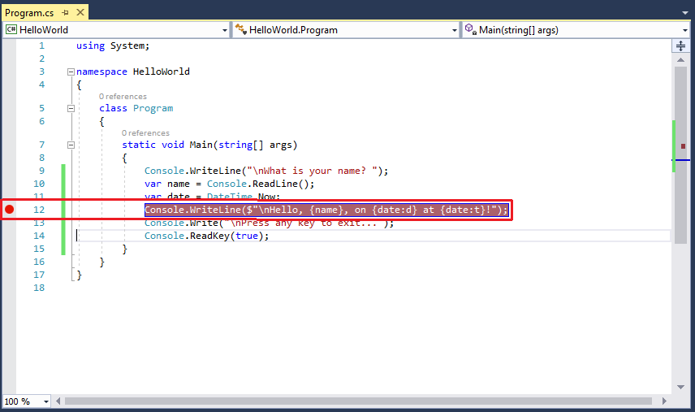
# [Visual Basic](#tab/visual-basic)
   Set a breakpoint on the line that reads `Console.WriteLine(vbCrLf + $"Hello, {name}, on {currentDate:d} at {currentDate:t}!")` by clicking in the left margin of the code window on that line or by choosing the **Debug** > **Toggle Breakpoint** menu item with the line selected. As the following figure shows, Visual Studio indicates the line on which the breakpoint is set by highlighting it and displaying a red circle in its left margin.

   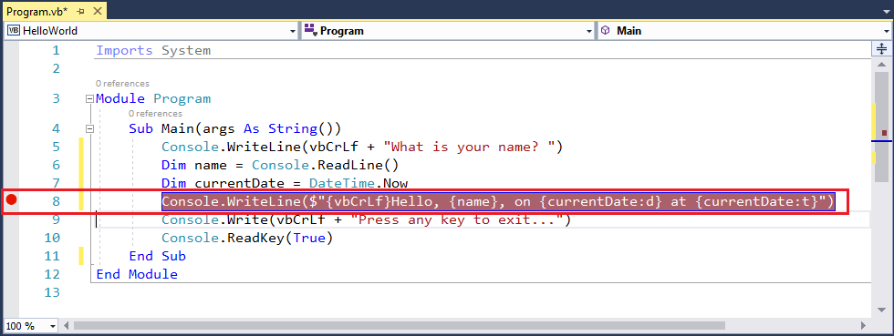
---

1. Run the program in Debug mode by selecting the **HelloWorld** button with the green arrow on the toolbar, pressing F5, or choosing **Debug** > **Start Debugging**.

1. Enter a string in the console window when the program prompts for a name and press Enter.

1. Program execution stops when it reaches the breakpoint and before the `Console.WriteLine` method executes. The **Autos** window displays the values of variables that are used around the current line. The **Locals** window (which you can view by clicking the **Locals** tab) displays the values of variables that are defined in the currently executing method.

# [C#](#tab/csharp)
   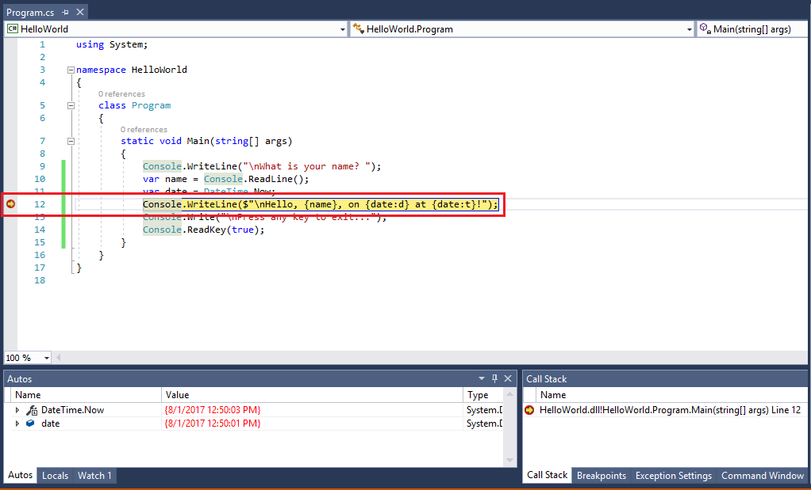
# [Visual Basic](#tab/visual-basic)
   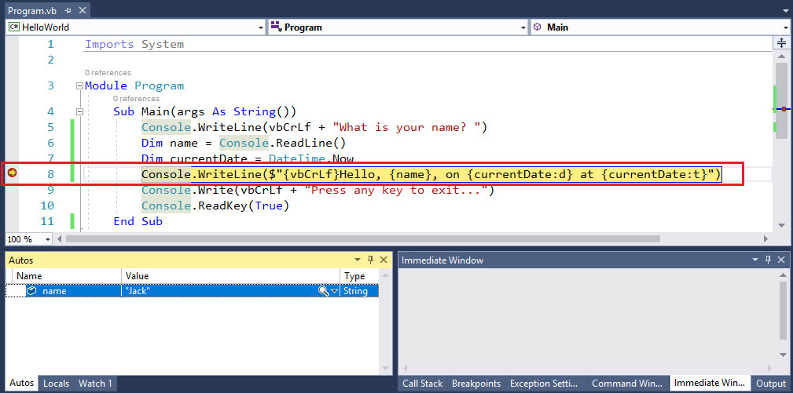
---

1. You can change the value of the variables to see how it affects your program. If the **Immediate Window** is not visible, display it by choosing the **Debug** > **Windows** > **Immediate** menu item. The **Immediate Window** lets you interact with the application you're debugging.

1. You can interactively change the values of variables. Enter `name = "Gracie"` in the **Immediate Window** and press the Enter key.

# [C#](#tab/csharp)
1. Enter `date = new DateTime(2016,11,01,11,59,00)` in the **Immediate Window** and press the Enter key.

   The **Immediate Window** displays the value of the string variable and the properties of the @System.DateTime value. In addition, the value of the variables is updated in the **Autos** and **Locals** windows.

   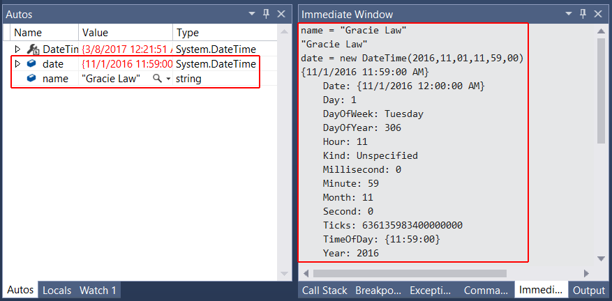
# [Visual Basic](#tab/visual-basic)
1. Enter `currentDate = new DateTime(2016,11,01,11,59,00)` in the **Immediate Window** and press the Enter key.

<!-- The **Immediate Window** displays the value of the string variable and the properties of the @System.DateTime value. In addition, the value of the variables is updated in the **Autos** and **Locals** windows.

   
-->
---

1. Continue program execution by selecting the **Continue** button in the toolbar or by selecting the **Debug** > **Continue** menu item. The values displayed in the console window correspond to the changes you made in the **Immediate Window**.

   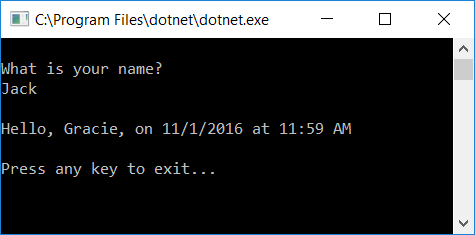

1. Press any key to exit the application and end Debug mode.

## Setting a conditional breakpoint

Your program displays the string that the user enters. What happens if the user doesn't enter anything? You can test this with a useful debugging feature, the *conditional breakpoint*, which breaks program execution when one or more conditions are met.

To set a conditional breakpoint and test what happens when the user fails to enter a string, do the following:

# [C#](#tab/csharp)
1. Right-click on the red dot that represents the breakpoint. On the context menu, select **Conditions** to open the **Breakpoint Settings** dialog. Check the box for **Conditions**.

   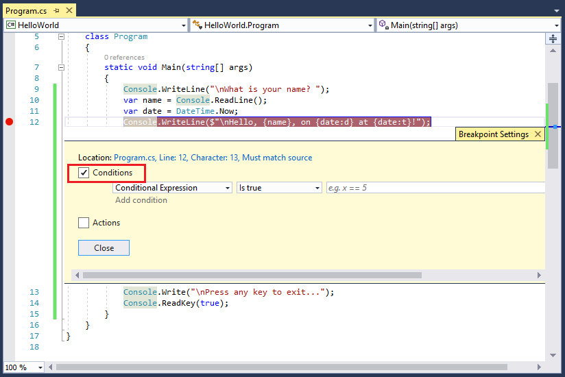

1. For the **Conditional Expression** replace "e.g. x == 5" with the following:

   ```csharp
   String.IsNullOrEmpty(name)
   ```
# [Visual Basic](#tab/visual-basic)
1. Right-click on the red dot that represents the breakpoint. On the context menu, select **Conditions** to open the **Breakpoint Settings** dialog. Check the box for **Conditions**.

   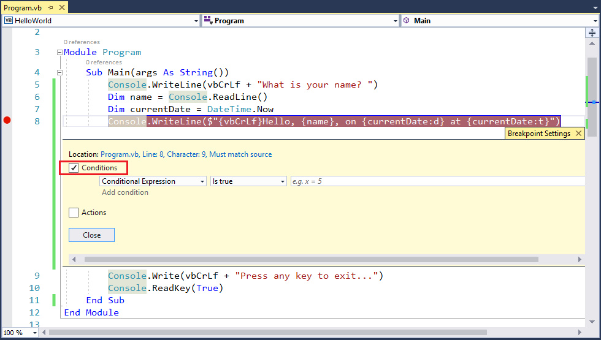

1. For the **Conditional Expression** replace "e.g. x = 5" with the following:

   ```vb
   String.IsNullOrEmpty(name)
   ```
---

   You're testing for a code condition, that the `String.IsNullOrEmpty(name)` method call is `true` either because *name* has not been assigned a value or because its value is an empty string (""). You can also specify a *hit count*, which interrupts program execution before a statement is executed a specified number of times, or a *filter condition*, which interrupts program execution based on such attributes as a thread identifier, process name, or thread name.

1. Select the **Close** button to close the dialog.

1. Run the program in Debug mode.

1. In the console window, press the Enter key when prompted to enter your name.

1. Because the condition we specified, `name` is either `null` or <xref:System.String.Empty?displayProperty=fullName>, has been satisfied, program execution stops when it reaches the breakpoint and before the `Console.WriteLine` method executes.

1. Select the **Locals** window, which shows the values of variables that are local to the currently executing method, which is the `Main` method in your program. Observe that the value of the `name` variable is `""`, or <xref:System.String.Empty?displayProperty=fullName>.

# [C#](#tab/csharp)
1. Confirm the value is an empty string by entering the following statement in the **Immediate Window**. The result is `true`.

   ```csharp
   ? name == String.Empty
   ```

   
# [Visual Basic](#tab/visual-basic)
1. Confirm the value is an empty string by entering the following statement in the **Immediate Window**. The result is `true`.

   ```vb
   ? String.IsNullOrEmpty(name)
   ```
  
---

1. Select the **Continue** button on the toolbar to continue program execution.

1. Press any key to close the console window and exit Debug mode.

1. Clear the breakpoint by clicking on the dot in the left margin of the code window or by choosing the **Debug > Toggle Breakpoint** menu item with the row selected.

---
## Stepping through a program

Visual Studio also allows you to step line by line through a program and monitor its execution. Ordinarily, you'd set a breakpoint and use this feature to follow program flow though a small part of your program code. Since your program is small, you can step through the entire program by doing the following:

# [C#](#tab/csharp)
1. On the menu bar, choose **Debug** > **Step Into** or press the F11 key. Visual Studio highlights and displays an arrow beside the next line of execution.

   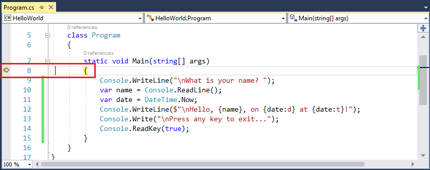

   At this point, the **Autos** window shows that your program has defined only one variable, `args`. Because you haven't passed any command-line arguments to the program, its value is an empty string array. In addition, Visual Studio has opened a blank console window.

1. Select **Debug** > **Step Into** or press the F11 key. Visual Studio now highlights the next line of execution. As the figure shows, it has taken less than one millisecond to execute the code between the last statement and this one. `args` remains the only declared variable, and the console window remains blank.

   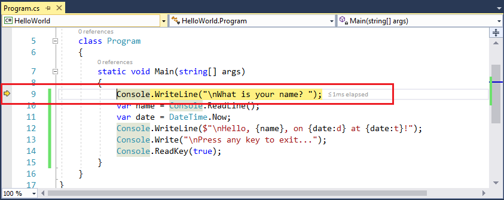
# [Visual Basic](#tab/visual-basic)
1. On the menu bar, choose **Debug** > **Step Into** or press the F11 key. Visual Studio highlights and displays an arrow beside the next line of execution.

   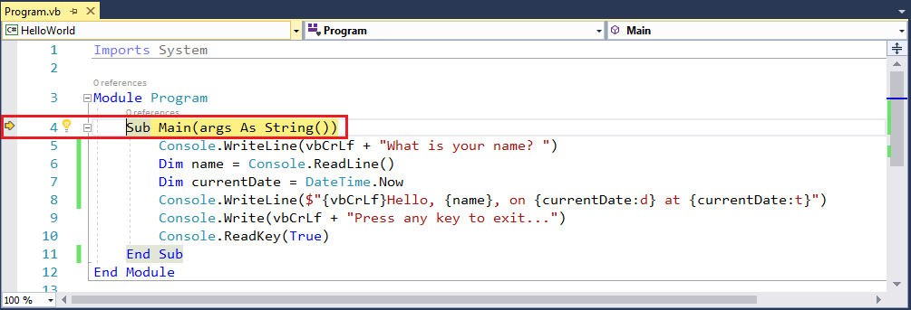

   At this point, because you haven't passed any command-line arguments to the program, the **Autos** window shows that the value of the `args` variable is an empty string array. In addition, Visual Studio has opened a blank console window.

1. Select **Debug** > **Step Into** or press the F11 key. Visual Studio now highlights the next line of execution. As the figure shows, it has taken less than one millisecond to execute the code between the last statement and this one. `args` remains the only declared variable, and the console window remains blank.

   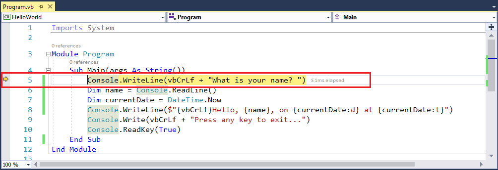
---

1. Select **Debug** > **Step Into** or press the F11 key. Visual Studio highlights the statement that includes the `name` variable assignment. The **Autos** window shows that `name` is `null` (in C#) or `Nothing` (in Visual Basic), and the console window displays the string "What is your name?".

1. Respond to the prompt by entering a string in the console window and pressing Enter. The console is unresponsive, and the string you enter isn't displayed in the console window, but the <xref:System.Console.ReadLine%2A?displayProperty=fullName> method will nevertheless capture your input.

1. Select **Debug** > **Step Into** or press the F11 key. Visual Studio highlights the statement that includes the `date` (in C#) or `currentDate` (in Visual Basic) variable assignment. The **Autos** window shows the <xref:System.DateTime.Now?displayProperty=fullName> property value and the value returned by the call to the <xref:System.Console.ReadLine%2A?displayProperty=fullName> method. The console window also displays the string entered when the console prompted for input.

1. Select **Debug** > **Step Into** or press the F11 key. The **Autos** window shows the value of the `date` variable after the assignment from the <xref:System.DateTime.Now?displayProperty=fullName> property. The console window is unchanged.

1. Select **Debug** > **Step Into** or press the F11 key. Visual Studio calls the <xref:System.Console.WriteLine(System.String,System.Object,System.Object)?displayProperty=fullName> method. The values of the `date` (or `currentDate`) and `name` variables appear in the **Autos** window, and the console window displays the formatted string.

1. Select **Debug** > **Step Out** or press Shift and the F11 key. This stops step-by-step execution. The console window displays a message and waits for you to press a key.

1. Press any key to close the console window and exit Debug mode.

## Building a Release version

Once you've tested the Debug build of your application, you should also compile and test the Release version. The Release version incorporates compiler optimizations that can sometimes negatively affect the behavior of an application. For example, compiler optimizations that are designed to improve performance can create race conditions in asynchronous or multithreaded applications.

To build and test the Release version of your console application, change the build configuration on the toolbar from **Debug** to **Release**.


When you press F5 or choose **Build Solution** from the **Build** menu, Visual Studio compiles the Release version of your console application. You can test it as you did the Debug version of the application.

Once you've finished debugging your application, the next step is to publish a deployable version of your application. For information on how to do this, see [Publish the Hello World application with Visual Studio 2017](./publishing-with-visual-studio.md).
