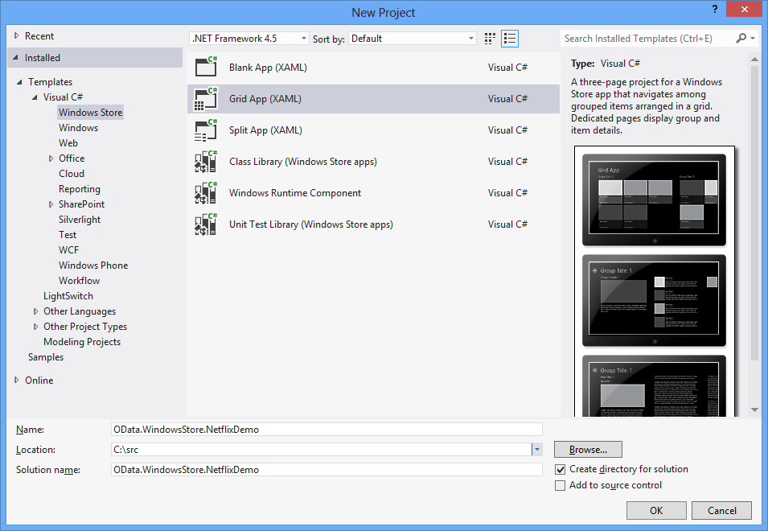
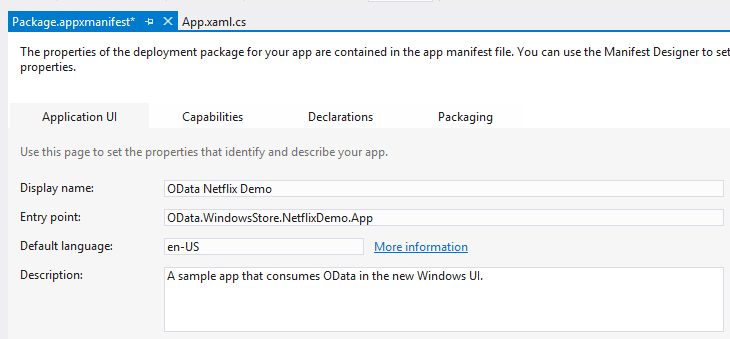
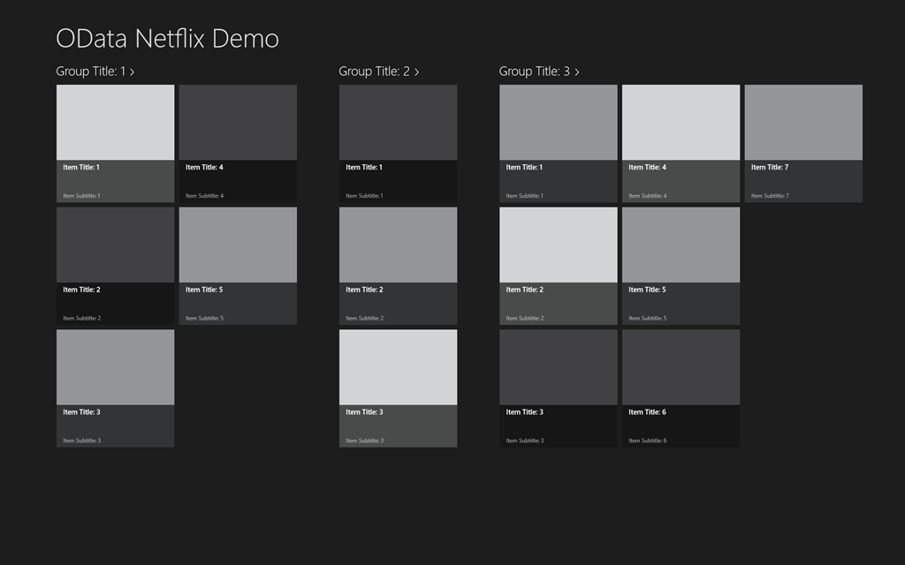
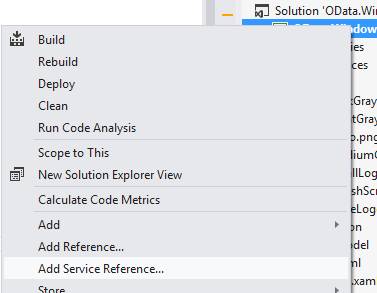
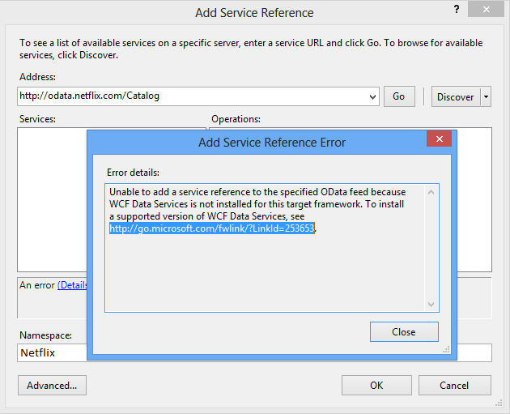
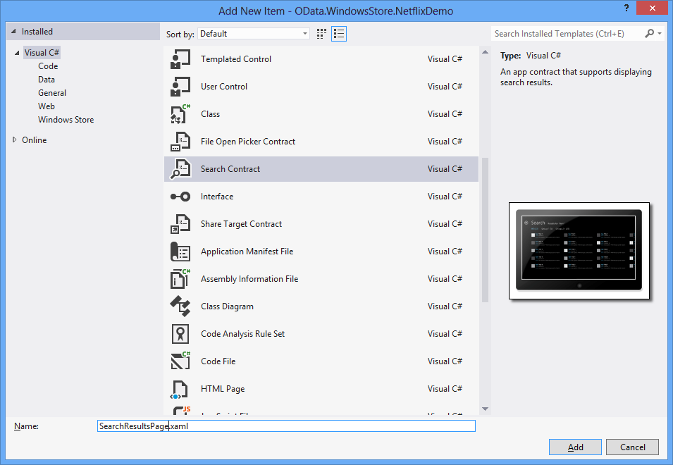

# Writing a Windows Store App that consumes an OData Service
Windows 8 introduces a new type of application: the Windows Store app. Windows Store apps have a brand new look and feel, run on a variety of devices, and are made available on the Windows Store. This topic describes how to write a Windows Store app that consumes an OData service, specifically the NetFlix Catalog OData service. For more information about Windows Store Apps, please read [Getting Started with Windows Store apps](http://msdn.microsoft.com/library/windows/apps/br211386.aspx).  
  
## Prerequisites  
  
1.  [Microsoft Windows 8](http://go.microsoft.com/fwlink/p/?LinkId=266654)  
  
2.  [Microsoft Visual Studio 2012](http://go.microsoft.com/fwlink/p/?LinkId=266655)  
  
3.  [WCF Data Services](http://msdn.microsoft.com/data/bb931106)  
  
#### Creating the default Windows Store Grid Application  
  
1.  Create a new Windows Store Grid Application using C# and XAML. Name the application OData.WindowsStore.NetflixDemo:  
  
       
  
2.  Open the Package.appxmanifest and enter a friendly name in the Display name text box. This specifies the application name used with the Windows 8 search functionality.  
  
       
  
3.  Enter a friendly name in the \<AppName> element in the App.xaml file. This sets the application name that is displayed when the application is launched:  
  
       
  
4.  Build and launch the application. You first see the application’s splash screen. The screenshot below displays the default splash screen. The image used is stored in the project’s Assets folder.  
  
       
  
     Then the application will be displayed.  
  
       
  
     The default application defines a set of classes in SampleDataSource.cs: SampleDataGroup and SampleDataItem, both of which are derived from SampleDataCommon, which itself is derived from BindableBase. SampleDataGroup and SampleDataItem are bound to the default GridView. SampleDataSource.cs is located in the DataModel folder within the NetflixDemo project. The application displays a grouped collection. Each group contains any number of items, represented by SampleDataGroup and SampleDataItem, respectively. In the previous screen shot you can see a group called Group Title 1 and all of the items in the group displayed together.  
  
     The main page of the application is GroupedItemsPage.xaml. It contains a GridView that displays the sample data created by the SampleDataSource.cs class. The GroupedItemsPage is loaded by the App.xaml.cs in a call to rootFrame.Navigate:  
  
    ```csharp  
    if (!rootFrame.Navigate(typeof(GroupedItemsPage), "AllGroups"))  
    {  
        throw new Exception("Failed to create initial page");  
    }  
    ```  
  
     This causes the GroupedItemsPage to be instantiated and it’s LoadState method is called. LoadState causes the static SampleDataSource instance to be created, which creates a collection of SampleDataGroup objects. Each SampleDataGroup object contains a collection of SampleDataItem objects. LoadState stores the collection of SampleDataGroup objects in the DefaultViewModel:  
  
    ```csharp  
    protected override void LoadState(Object navigationParameter, Dictionary<String, Object> pageState)  
    {  
        var sampleDataGroups = SampleDataSource.GetGroups((String)navigationParameter);  
        this.DefaultViewModel["Groups"] = sampleDataGroups;  
    }  
    ```  
  
     The DefaultViewModel is then bound to the GridView. This is referenced in the GroupedItemsPage.xaml file when configuring the data binding.  
  
    ```cpp  
    <CollectionViewSource  
                x:Name="groupedItemsViewSource"  
                Source="{Binding Groups}"  
                IsSourceGrouped="true"  
                ItemsPath="TopItems"  
                d:Source="{Binding AllGroups, Source={d:DesignInstance Type=data:SampleDataSource, IsDesignTimeCreatable=True}}"/>  
    ```  
  
     The CollectionViewSource is used as a proxy for handling grouped collections. When binding occurs, it iterates through the collection of SampleDataGroup objects to populate the GridView.  The ItemsPath attribute tells the CollectionViewSource what property on each SampleDataGroup object to use to find the SampleDataItems it contains. In this case each SampleDataGroup object contains a TopItems collection of SampleDataItem objects.  
  
     For the Netflix application, movies are grouped by genre. So the application displays a number of genres and a list of movies within that genre.  
  
#### Add a Service Reference to the Netflix OData Service  
  
1.  Before we can make any calls to the Netflix OData service we need to add a service reference. Right-click the project in the Solution Explorer and select Add Service Reference…  
  
       
  
2.  Enter the URL for the Netflix OData service in the Address bar and click Go. Set the Namespace of the service reference to Netflix and click OK.  
  
       
  
    > [!NOTE]
    >  If you have not yet installed [WCF Data Services Tools for Windows Store Apps](http://go.microsoft.com/fwlink/p/?LinkId=266652), you will be prompted with a message such as the one above. You will need to download and install the tools referenced in the link to continue.  
  
 Adding a service reference generates strongly typed classes that WCF Data Services will use to parse the OData returned by the Netflix OData service. The classes defined in SampleDataSource.cs can be bound to the GridView so we need to transfer the data from the generated OData client classes into the bindable classes defined in SampleDataSource.cs.  In order to do this, we need to make some changes to the data model defined in SampleDataSource.cs.  
  
#### Update the data model for the application  
  
1.  Replace the existing code in SampleDataSource.cs with the code from [this gist](https://gist.github.com/3419288). The updated code adds a LoadMovies method (to the SampleDataSource class)  that performs a query against the Netflix OData service and populates a list of genres (allGroups) and within each genre a list of movies. The SampleDataGroup class is used to represent a genre and the SampleDataItem class is used to represent a movie.  
  
    ```csharp  
    public static async void LoadMovies()  
    {  
        IEnumerable<Title> titles = await ((DataServiceQuery<Title>)Context.Titles  
            .Expand("Genres,AudioFormats,AudioFormats/Language,Awards,Cast")  
            .Where(t => t.Rating == "PG")  
            .OrderByDescending(t => t.ReleaseYear)  
            .Take(300)).ExecuteAsync();  
  
        foreach (Title title in titles)  
        {  
            foreach (Genre netflixGenre in title.Genres)  
            {  
                SampleDataGroup genre = GetGroup(netflixGenre.Name);  
                if (genre == null)  
                {  
                    genre = new SampleDataGroup(netflixGenre.Name, netflixGenre.Name, String.Empty, title.BoxArt.LargeUrl, String.Empty);  
                    Instance.AllGroups.Add(genre);  
                }  
                var content = new StringBuilder();  
                // Write additional things to content here if you want them to display in the item detail.  
                genre.Items.Add(new SampleDataItem(title.Id, title.Name, String.Format("{0}rnrn{1} ({2})", title.Synopsis, title.Rating, title.ReleaseYear), title.BoxArt.HighDefinitionUrl ?? title.BoxArt.LargeUrl, "Description", content.ToString()));  
            }  
        }  
    }  
    ```  
  
     The [Task-based Asynchronous Pattern](http://go.microsoft.com/fwlink/p/?LinkId=266651) (TAP) is used to asynchronously get 300 (Take) recent (OrderByDescending) PG-rated (Where) movies back from Netflix. The rest of the code constructs SimpleDataItems and SimpleDataGroups from the entities that were returned in the OData feed.  
  
     The SampleDataSource class also implements a simple search method. In this case, it does a simple in-memory search of the loaded movies.  
  
    ```csharp  
    public static IEnumerable<SampleDataItem> Search(string searchString)  
    {  
            var regex = new Regex(searchString, RegexOptions.CultureInvariant | RegexOptions.IgnoreCase | RegexOptions.IgnorePatternWhitespace);  
            return Instance.AllGroups  
                .SelectMany(g => g.Items)  
                .Where(m => regex.IsMatch(m.Title) || regex.IsMatch(m.Subtitle))  
                    .Distinct(new SampleDataItemComparer());  
    }  
    ```  
  
     Also in SampleDataSource.cs a class called ExtensionMethods is defined. Each of these extension methods uses the TAP pattern to allow the SampleDataSource to execute an OData query without blocking the UI. For example, the following code uses the Task.Factory.FromAsync method to implement TAP.  
  
    ```csharp  
    public static async Task<IEnumerable<T>> ExecuteAsync<T>(this DataServiceQuery<T> query)  
    {  
        return await Task.Factory.FromAsync<IEnumerable<T>>(query.BeginExecute(null, null), query.EndExecute);  
    }  
    ```  
  
     As in the default application, the main page of the application is GroupedItemsPage. This time, however, it displays the movies retrieved from Netflix grouped by genre.  When the GroupedItemsPage is instantiated, its LoadState method is called. LoadState causes the static SampleDataSource instance to be created, making a call to the Netflix OData service as discussed previously. LoadState stores the collection of genres (SampleDataGroup objects) in the DefaultViewModel:  
  
    ```csharp  
    protected override void LoadState(Object navigationParameter, Dictionary<String, Object> pageState)  
    {  
  
        var sampleDataGroups = SampleDataSource.GetGroups((String)navigationParameter);  
        this.DefaultViewModel["Groups"] = sampleDataGroups;  
    }  
    ```  
  
     As described previously, the DefaultViewModel is then used to bind the data to the GridView.  
  
#### Add a search contract to allow the application to participate in Windows search  
  
1.  Add a search contract to the application. This allows the application to integrate with the Windows 8 search experience. Name the search contract SearchResultsPage.xaml  
  
       
  
2.  Modify line 58 of SearchResultsPage.xaml.cs by removing the embedded quotes around queryText.  
  
    ```csharp  
    // Communicate results through the view model  
    this.DefaultViewModel["QueryText"] = queryText;  
    this.DefaultViewModel["Filters"] = filterList;  
    this.DefaultViewModel["ShowFilters"] = filterList.Count > 1;  
    ```  
  
3.  Insert the following two lines of code at line 81 in SearchResultsPage.xaml.cs to retrieve the search results.  
  
    ```csharp  
    // TODO: Respond to the change in active filter by setting this.DefaultViewModel["Results"]  
                    //       to a collection of items with bindable Image, Title, Subtitle, and Description properties  
                    var searchValue = (string)this.DefaultViewModel["QueryText"];  
                    this.DefaultViewModel["Results"] = new List<SampleDataItem>(SampleDataSource.Search(searchValue));  
    ```  
  
 When a user invokes Windows search, types in a search term and then touches the Netflix Demo app icon in the search bar, the LoadState method of the SearchResultsPage is executed. The navigation parameter sent to LoadState contains the query text. Next the Filter_SelectionChanged method is called which then calls the Search method on the SampleDataSource class. The results are returned and displayed in the SearchResultsPage.xaml page.  
  
```csharp  
/// <summary>  
        /// Invoked when a filter is selected using the ComboBox in snapped view state.  
        /// </summary>  
        /// <param name="sender">The ComboBox instance.</param>  
        /// <param name="e">Event data describing how the selected filter was changed.</param>  
        void Filter_SelectionChanged(object sender, SelectionChangedEventArgs e)  
        {  
            // Determine what filter was selected  
            var selectedFilter = e.AddedItems.FirstOrDefault() as Filter;  
            if (selectedFilter != null)  
            {  
                // Mirror the results into the corresponding Filter object to allow the  
                // RadioButton representation used when not snapped to reflect the change  
                selectedFilter.Active = true;  
  
                // TODO: Respond to the change in active filter by setting this.DefaultViewModel["Results"]  
                //       to a collection of items with bindable Image, Title, Subtitle, and Description properties  
                var searchValue = (string)this.DefaultViewModel["QueryText"];  
                this.DefaultViewModel["Results"] = new List<SampleDataItem>(SampleDataSource.Search(searchValue));  
  
                // Ensure results are found  
                object results;  
                ICollection resultsCollection;  
                if (this.DefaultViewModel.TryGetValue("Results", out results) &&  
                    (resultsCollection = results as ICollection) != null &&  
                    resultsCollection.Count != 0)  
                {  
                    VisualStateManager.GoToState(this, "ResultsFound", true);  
                    return;  
                }  
            }  
  
            // Display informational text when there are no search results.  
            VisualStateManager.GoToState(this, "NoResultsFound", true);  
        }  
```  
  
 For more information on integrating search into an application see, [Search: integrating into the Windows 8 search experience](http://go.microsoft.com/fwlink/p/?LinkId=266650).  
  
## Run the application  
 Launch the application by pressing F5. Note that it will take a few seconds to load the images upon application launch. Also, your first search attempt may not return any results. In a real-world application, you would want to deal with both of these issues.  
  
 The application calls the Netflix OData service, receives the data in the generated OData client classes and then transfers that data to bindable data classes (SampleDataSource, SampleDataGroup, and SampleDataItem). It uses these bindable classes to bind the data to the GridView. If you are unfamiliar with how XAML databinding works see [How to group items in a list or grid (Windows Store apps using C#/VB/C++ and XAML)](http://msdn.microsoft.com/library/windows/apps/xaml/hh780627).
