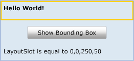

# Layout
This topic describes the [!INCLUDE[TLA#tla_winclient](../../../../includes/tlasharptla-winclient-md.md)] layout system. Understanding how and when layout calculations occur is essential for creating user interfaces in [!INCLUDE[TLA2#tla_winclient](../../../../includes/tla2sharptla-winclient-md.md)].  
  
 This topic contains the following sections:  
  
-   [Element Bounding Boxes](#LayoutSystem_BoundingBox)  
  
-   [The Layout System](#LayoutSystem_Overview)  
  
-   [Measuring and Arranging Children](#LayoutSystem_Measure_Arrange)  
  
-   [Panel Elements and Custom Layout Behaviors](#LayoutSystem_PanelsCustom)  
  
-   [Layout Performance Considerations](#LayoutSystem_Performance)  
  
-   [Sub-pixel Rendering and Layout Rounding](#LayoutSystem_LayoutRounding)  
  
-   [What's Next](#LayoutSystem_whatsnext)  
  
   
## Element Bounding Boxes  
 When thinking about layout in [!INCLUDE[TLA2#tla_winclient](../../../../includes/tla2sharptla-winclient-md.md)], it is important to understand the bounding box that surrounds all elements. Each <xref:System.Windows.FrameworkElement> consumed by the layout system can be thought of as a rectangle that is slotted into the layout. The <xref:System.Windows.Controls.Primitives.LayoutInformation> class returns the boundaries of an element's layout allocation, or slot. The size of the rectangle is determined by calculating the available screen space, the size of any constraints, layout-specific properties (such as margin and padding), and the individual behavior of the parent <xref:System.Windows.Controls.Panel> element. Processing this data, the layout system is able to calculate the position of all the children of a particular <xref:System.Windows.Controls.Panel>. It is important to remember that sizing characteristics defined on the parent element, such as a <xref:System.Windows.Controls.Border>, affect its children.  
  
 The following illustration shows a simple layout.  
  
   
  
 This layout can be achieved by using the following [!INCLUDE[TLA2#tla_xaml](../../../../includes/tla2sharptla-xaml-md.md)].  
  
 [!code-xaml[LayoutInformation#1](../../../../samples/snippets/csharp/VS_Snippets_Wpf/LayoutInformation/CSharp/Window1.xaml#1)]  
  
 A single <xref:System.Windows.Controls.TextBlock> element is hosted within a <xref:System.Windows.Controls.Grid>. While the text fills only the upper-left corner of the first column, the allocated space for the <xref:System.Windows.Controls.TextBlock> is actually much larger. The bounding box of any <xref:System.Windows.FrameworkElement> can be retrieved by using the <xref:System.Windows.Controls.Primitives.LayoutInformation.GetLayoutSlot%2A> method. The following illustration shows the bounding box for the <xref:System.Windows.Controls.TextBlock> element.  
  
   
  
 As shown by the yellow rectangle, the allocated space for the <xref:System.Windows.Controls.TextBlock> element is actually much larger than it appears. As additional elements are added to the <xref:System.Windows.Controls.Grid>, this allocation could shrink or expand, depending on the type and size of elements that are added.  
  
 The layout slot of the <xref:System.Windows.Controls.TextBlock> is translated into a <xref:System.Windows.Shapes.Path> by using the <xref:System.Windows.Controls.Primitives.LayoutInformation.GetLayoutSlot%2A> method. This technique can be useful for displaying the bounding box of an element.  
  
 [!code-csharp[LayoutInformation#2](../../../../samples/snippets/csharp/VS_Snippets_Wpf/LayoutInformation/CSharp/Window1.xaml.cs#2)]
 [!code-vb[LayoutInformation#2](../../../../samples/snippets/visualbasic/VS_Snippets_Wpf/LayoutInformation/VisualBasic/Window1.xaml.vb#2)]  
  
   
## The Layout System  
 At its simplest, layout is a recursive system that leads to an element being sized, positioned, and drawn. More specifically, layout describes the process of measuring and arranging the members of a <xref:System.Windows.Controls.Panel> element's <xref:System.Windows.Controls.Panel.Children%2A> collection. Layout is an intensive process. The larger the <xref:System.Windows.Controls.Panel.Children%2A> collection, the greater the number of calculations that must be made. Complexity can also be introduced based on the layout behavior defined by the <xref:System.Windows.Controls.Panel> element that owns the collection. A relatively simple <xref:System.Windows.Controls.Panel>, such as <xref:System.Windows.Controls.Canvas>, can have significantly better performance than a more complex <xref:System.Windows.Controls.Panel>, such as <xref:System.Windows.Controls.Grid>.  
  
 Each time that a child <xref:System.Windows.UIElement> changes its position, it has the potential to trigger a new pass by the layout system. Therefore, it is important to understand the events that can invoke the layout system, as unnecessary invocation can lead to poor application performance. The following describes the process that occurs when the layout system is invoked.  
  
1.  A child <xref:System.Windows.UIElement> begins the layout process by first having its core properties measured.  
  
2.  Sizing properties defined on <xref:System.Windows.FrameworkElement> are evaluated, such as <xref:System.Windows.FrameworkElement.Width%2A>, <xref:System.Windows.FrameworkElement.Height%2A>, and <xref:System.Windows.FrameworkElement.Margin%2A>.  
  
3.  <xref:System.Windows.Controls.Panel>-specific logic is applied, such as <xref:System.Windows.Controls.Dock> direction or stacking <xref:System.Windows.Controls.StackPanel.Orientation%2A>.  
  
4.  Content is arranged after all children have been measured.  
  
5.  The <xref:System.Windows.Controls.Panel.Children%2A> collection is drawn on the screen.  
  
6.  The process is invoked again if additional <xref:System.Windows.Controls.Panel.Children%2A> are added to the collection, a <xref:System.Windows.FrameworkElement.LayoutTransform%2A> is applied, or the <xref:System.Windows.UIElement.UpdateLayout%2A> method is called.  
  
 This process and how it is invoked are defined in more detail in the following sections.  
  
   
## Measuring and Arranging Children  
 The layout system completes two passes for each member of the <xref:System.Windows.Controls.Panel.Children%2A> collection, a measure pass and an arrange pass. Each child <xref:System.Windows.Controls.Panel> provides its own <xref:System.Windows.FrameworkElement.MeasureOverride%2A> and <xref:System.Windows.FrameworkElement.ArrangeOverride%2A> methods to achieve its own specific layout behavior.  
  
 During the measure pass, each member of the <xref:System.Windows.Controls.Panel.Children%2A> collection is evaluated. The process begins with a call to the <xref:System.Windows.UIElement.Measure%2A> method. This method is called within the implementation of the parent <xref:System.Windows.Controls.Panel> element, and does not have to be called explicitly for layout to occur.  
  
 First, native size properties of the <xref:System.Windows.UIElement> are evaluated, such as <xref:System.Windows.UIElement.Clip%2A> and <xref:System.Windows.UIElement.Visibility%2A>. This generates a value named `constraintSize` that is passed to <xref:System.Windows.FrameworkElement.MeasureCore%2A>.  
  
 Secondly, framework properties defined on <xref:System.Windows.FrameworkElement> are processed, which affects the value of `constraintSize`. These properties generally describe the sizing characteristics of the underlying <xref:System.Windows.UIElement>, such as its <xref:System.Windows.FrameworkElement.Height%2A>, <xref:System.Windows.FrameworkElement.Width%2A>, <xref:System.Windows.FrameworkElement.Margin%2A>, and <xref:System.Windows.FrameworkElement.Style%2A>. Each of these properties can change the space that is necessary to display the element. <xref:System.Windows.FrameworkElement.MeasureOverride%2A> is then called with `constraintSize` as a parameter.  
  
> [!NOTE]
>  There is a difference between the properties of <xref:System.Windows.FrameworkElement.Height%2A> and <xref:System.Windows.FrameworkElement.Width%2A> and <xref:System.Windows.FrameworkElement.ActualHeight%2A> and <xref:System.Windows.FrameworkElement.ActualWidth%2A>. For example, the <xref:System.Windows.FrameworkElement.ActualHeight%2A> property is a calculated value based on other height inputs and the layout system. The value is set by the layout system itself, based on an actual rendering pass, and may therefore lag slightly behind the set value of properties, such as <xref:System.Windows.FrameworkElement.Height%2A>, that are the basis of the input change.  
>   
>  Because <xref:System.Windows.FrameworkElement.ActualHeight%2A> is a calculated value, you should be aware that there could be multiple or incremental reported changes to it as a result of various operations by the layout system. The layout system may be calculating required measure space for child elements, constraints by the parent element, and so on.  
  
 The ultimate goal of the measure pass is for the child to determine its <xref:System.Windows.UIElement.DesiredSize%2A>, which occurs during the <xref:System.Windows.FrameworkElement.MeasureCore%2A> call. The <xref:System.Windows.UIElement.DesiredSize%2A> value is stored by <xref:System.Windows.UIElement.Measure%2A> for use during the content arrange pass.  
  
 The arrange pass begins with a call to the <xref:System.Windows.UIElement.Arrange%2A> method. During the arrange pass, the parent <xref:System.Windows.Controls.Panel> element generates a rectangle that represents the bounds of the child. This value is passed to the <xref:System.Windows.FrameworkElement.ArrangeCore%2A> method for processing.  
  
 The <xref:System.Windows.FrameworkElement.ArrangeCore%2A> method evaluates the <xref:System.Windows.UIElement.DesiredSize%2A> of the child and evaluates any additional margins that may affect the rendered size of the element. <xref:System.Windows.FrameworkElement.ArrangeCore%2A> generates an `arrangeSize`, which is passed to the <xref:System.Windows.FrameworkElement.ArrangeOverride%2A> method of the <xref:System.Windows.Controls.Panel> as a parameter. <xref:System.Windows.FrameworkElement.ArrangeOverride%2A> generates the `finalSize` of the child. Finally, the <xref:System.Windows.FrameworkElement.ArrangeCore%2A> method does a final evaluation of offset properties, such as margin and alignment, and puts the child within its layout slot. The child does not have to (and frequently does not) fill the entire allocated space. Control is then returned to the parent <xref:System.Windows.Controls.Panel> and the layout process is complete.  
  
   
## Panel Elements and Custom Layout Behaviors  
 [!INCLUDE[TLA2#tla_winclient](../../../../includes/tla2sharptla-winclient-md.md)] includes a group of elements that derive from <xref:System.Windows.Controls.Panel>. These <xref:System.Windows.Controls.Panel> elements enable many complex layouts. For example, stacking elements can easily be achieved by using the <xref:System.Windows.Controls.StackPanel> element, while more complex and free flowing layouts are possible by using a <xref:System.Windows.Controls.Canvas>.  
  
 The following table summarizes the available layout <xref:System.Windows.Controls.Panel> elements.  
  
|Panel name|Description|  
|----------------|-----------------|  
|<xref:System.Windows.Controls.Canvas>|Defines an area within which you can explicitly position child elements by coordinates relative to the <xref:System.Windows.Controls.Canvas> area.|  
|<xref:System.Windows.Controls.DockPanel>|Defines an area within which you can arrange child elements either horizontally or vertically, relative to each other.|  
|<xref:System.Windows.Controls.Grid>|Defines a flexible grid area that consists of columns and rows.|  
|<xref:System.Windows.Controls.StackPanel>|Arranges child elements into a single line that can be oriented horizontally or vertically.|  
|<xref:System.Windows.Controls.VirtualizingPanel>|Provides a framework for <xref:System.Windows.Controls.Panel> elements that virtualize their child data collection. This is an abstract class.|  
|<xref:System.Windows.Controls.WrapPanel>|Positions child elements in sequential position from left to right, breaking content to the next line at the edge of the containing box. Subsequent ordering occurs sequentially from top to bottom or right to left, depending on the value of the <xref:System.Windows.Controls.WrapPanel.Orientation%2A> property.|  
  
 For applications that require a layout that is not possible by using any of the predefined <xref:System.Windows.Controls.Panel> elements, custom layout behaviors can be achieved by inheriting from <xref:System.Windows.Controls.Panel> and overriding the <xref:System.Windows.FrameworkElement.MeasureOverride%2A> and <xref:System.Windows.FrameworkElement.ArrangeOverride%2A> methods. For an example, see [Custom Radial Panel Sample](http://go.microsoft.com/fwlink/?LinkID=159982).  
  
   
## Layout Performance Considerations  
 Layout is a recursive process. Each child element in a <xref:System.Windows.Controls.Panel.Children%2A> collection gets processed during each invocation of the layout system. As a result, triggering the layout system should be avoided when it is not necessary. The following considerations can help you achieve better performance.  
  
-   Be aware of which property value changes will force a recursive update by the layout system.  
  
     Dependency properties whose values can cause the layout system to be initialized are marked with public flags. <xref:System.Windows.FrameworkPropertyMetadata.AffectsMeasure%2A> and <xref:System.Windows.FrameworkPropertyMetadata.AffectsArrange%2A> provide useful clues as to which property value changes will force a recursive update by the layout system. In general, any property that can affect the size of an element's bounding box should have a <xref:System.Windows.FrameworkPropertyMetadata.AffectsMeasure%2A> flag set to true. For more information, see [Dependency Properties Overview](../../../../docs/framework/wpf/advanced/dependency-properties-overview.md).  
  
-   When possible, use a <xref:System.Windows.UIElement.RenderTransform%2A> instead of a <xref:System.Windows.FrameworkElement.LayoutTransform%2A>.  
  
     A <xref:System.Windows.FrameworkElement.LayoutTransform%2A> can be a very useful way to affect the content of a [!INCLUDE[TLA#tla_ui](../../../../includes/tlasharptla-ui-md.md)]. However, if the effect of the transform does not have to impact the position of other elements, it is best to use a <xref:System.Windows.UIElement.RenderTransform%2A> instead, because <xref:System.Windows.UIElement.RenderTransform%2A> does not invoke the layout system. <xref:System.Windows.FrameworkElement.LayoutTransform%2A> applies its transformation and forces a recursive layout update to account for the new position of the affected element.  
  
-   Avoid unnecessary calls to <xref:System.Windows.UIElement.UpdateLayout%2A>.  
  
     The <xref:System.Windows.UIElement.UpdateLayout%2A> method forces a recursive layout update, and is frequently not necessary. Unless you are sure that a full update is required, rely on the layout system to call this method for you.  
  
-   When working with a large <xref:System.Windows.Controls.Panel.Children%2A> collection, consider using a <xref:System.Windows.Controls.VirtualizingStackPanel> instead of a regular <xref:System.Windows.Controls.StackPanel>.  
  
     By virtualizing the child collection, the <xref:System.Windows.Controls.VirtualizingStackPanel> only keeps objects in memory that are currently within the parent's ViewPort. As a result, performance is substantially improved in most scenarios.  
  
   
## Sub-pixel Rendering and Layout Rounding  
 The [!INCLUDE[TLA2#tla_winclient](../../../../includes/tla2sharptla-winclient-md.md)] graphics system uses device-independent units to enable resolution and device independence. Each device independent pixel automatically scales with the system's [!INCLUDE[TLA#tla_dpi](../../../../includes/tlasharptla-dpi-md.md)] setting. This provides [!INCLUDE[TLA2#tla_winclient](../../../../includes/tla2sharptla-winclient-md.md)] applications proper scaling for different [!INCLUDE[TLA2#tla_dpi](../../../../includes/tla2sharptla-dpi-md.md)] settings and makes the application automatically [!INCLUDE[TLA2#tla_dpi](../../../../includes/tla2sharptla-dpi-md.md)]-aware.  
  
 However, this [!INCLUDE[TLA2#tla_dpi](../../../../includes/tla2sharptla-dpi-md.md)] independence can create irregular edge rendering because of anti-aliasing. These artifacts, typically seen as blurry or semi-transparent edges, can occur when the location of an edge falls in the middle of a device pixel instead of between device pixels. The layout system provides a way to adjust for this with layout rounding. Layout rounding is where the layout system rounds any non-integral pixel values during the layout pass.  
  
 Layout rounding is disabled by default. To enable layout rounding, set the <xref:System.Windows.FrameworkElement.UseLayoutRounding%2A> property to `true` on any <xref:System.Windows.FrameworkElement>. Because it is a dependency property, the value will propagate to all the children in the visual tree. To enable layout rounding for the entire UI, set <xref:System.Windows.FrameworkElement.UseLayoutRounding%2A> to `true` on the root container. For an example, see <xref:System.Windows.FrameworkElement.UseLayoutRounding%2A>.  
  
   
## What's Next  
 Understanding how elements are measured and arranged is the first step in understanding layout. For more information about the available <xref:System.Windows.Controls.Panel> elements, see [Panels Overview](../../../../docs/framework/wpf/controls/panels-overview.md). To better understand the various positioning properties that can affect layout, see [Alignment, Margins, and Padding Overview](../../../../docs/framework/wpf/advanced/alignment-margins-and-padding-overview.md). For an example of a custom <xref:System.Windows.Controls.Panel> element, see [Custom Radial Panel Sample](http://go.microsoft.com/fwlink/?LinkID=159982). When you are ready to put it all together in a light-weight application, see [Walkthrough: My first WPF desktop application](../../../../docs/framework/wpf/getting-started/walkthrough-my-first-wpf-desktop-application.md).  
  
## See Also  
 <xref:System.Windows.FrameworkElement>   
 <xref:System.Windows.UIElement>   
 [Panels Overview](../../../../docs/framework/wpf/controls/panels-overview.md)   
 [Alignment, Margins, and Padding Overview](../../../../docs/framework/wpf/advanced/alignment-margins-and-padding-overview.md)   
 [Layout and Design](../../../../docs/framework/wpf/advanced/optimizing-performance-layout-and-design.md)
