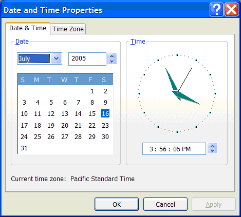
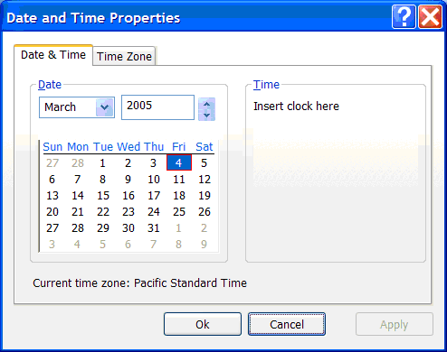
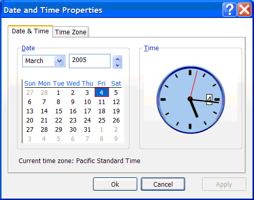

# Walkthrough: Hosting a WPF Clock in Win32
To put              [!INCLUDE[TLA2#tla_winclient](../../../../includes/tla2sharptla-winclient-md.md)] inside              [!INCLUDE[TLA2#tla_win32](../../../../includes/tla2sharptla-win32-md.md)] applications, use              <xref:System.Windows.Interop.HwndSource>, which provides the HWND that contains your              [!INCLUDE[TLA2#tla_winclient](../../../../includes/tla2sharptla-winclient-md.md)] content. First you create the              <xref:System.Windows.Interop.HwndSource>, giving it parameters similar to CreateWindow.  Then you tell the              <xref:System.Windows.Interop.HwndSource> about the              [!INCLUDE[TLA2#tla_winclient](../../../../includes/tla2sharptla-winclient-md.md)] content you want inside it.  Finally, you get the HWND out of the              <xref:System.Windows.Interop.HwndSource>. This walkthrough illustrates how to create a mixed              [!INCLUDE[TLA2#tla_winclient](../../../../includes/tla2sharptla-winclient-md.md)] inside              [!INCLUDE[TLA2#tla_win32](../../../../includes/tla2sharptla-win32-md.md)] application that reimplements the operating system              **Date and Time Properties** dialog.  
  
## Prerequisites  
 See                  [WPF and Win32 Interoperation](../../../../docs/framework/wpf/advanced/wpf-and-win32-interoperation.md).  
  
## How to Use This Tutorial  
 This tutorial concentrates on the important steps of producing an interoperation application. The tutorial is backed by a sample,                  [Win32 Clock Interoperation Sample](http://go.microsoft.com/fwlink/?LinkID=160051), but that sample is reflective of the end product. This tutorial documents the steps as if you were starting with an existing                  [!INCLUDE[TLA2#tla_win32](../../../../includes/tla2sharptla-win32-md.md)] project of your own, perhaps a pre-existing project, and you were adding a hosted                  [!INCLUDE[TLA2#tla_winclient](../../../../includes/tla2sharptla-winclient-md.md)] to your application. You can compare your end product with                  [Win32 Clock Interoperation Sample](http://go.microsoft.com/fwlink/?LinkID=160051).  
  
## A Walkthrough of Windows Presentation Framework Inside Win32 (HwndSource)  
 The following graphic shows the intended end product of this tutorial:  
  
   
  
 You can recreate this dialog by creating C++                  [!INCLUDE[TLA2#tla_win32](../../../../includes/tla2sharptla-win32-md.md)] project in                  [!INCLUDE[TLA#tla_visualstu](../../../../includes/tlasharptla-visualstu-md.md)], and using the dialog editor to create the following:  
  
   
  
 (You do not need to use                  [!INCLUDE[TLA#tla_visualstu](../../../../includes/tlasharptla-visualstu-md.md)] to use                  <xref:System.Windows.Interop.HwndSource>, and you do not need to use C++ to write                  [!INCLUDE[TLA2#tla_win32](../../../../includes/tla2sharptla-win32-md.md)] programs, but this is a fairly typical way to do it, and lends itself well to a stepwise tutorial explanation).  
  
 You need to accomplish five particular substeps in order to put a                  [!INCLUDE[TLA2#tla_winclient](../../../../includes/tla2sharptla-winclient-md.md)] clock into the dialog:  
  
1.  Enable your                          [!INCLUDE[TLA2#tla_win32](../../../../includes/tla2sharptla-win32-md.md)] project to call managed code (                         **/clr**) by changing project settings in                          [!INCLUDE[TLA#tla_visualstu](../../../../includes/tlasharptla-visualstu-md.md)].  
  
2.  Create a [!INCLUDE[TLA2#tla_winclient](../../../../includes/tla2sharptla-winclient-md.md)]<xref:System.Windows.Controls.Page> in a separate DLL.  
  
3.  Put that [!INCLUDE[TLA2#tla_winclient](../../../../includes/tla2sharptla-winclient-md.md)]<xref:System.Windows.Controls.Page> inside an <xref:System.Windows.Interop.HwndSource>.  
  
4.  Get an HWND for that                          <xref:System.Windows.Controls.Page> using the                           <xref:System.Windows.Interop.HwndSource.Handle%2A> property.  
  
5.  Use                          [!INCLUDE[TLA2#tla_win32](../../../../includes/tla2sharptla-win32-md.md)] to decide where to place the HWND within the larger                          [!INCLUDE[TLA2#tla_win32](../../../../includes/tla2sharptla-win32-md.md)] application  
  
## /clr  
 The first step is to turn this unmanaged                  [!INCLUDE[TLA2#tla_win32](../../../../includes/tla2sharptla-win32-md.md)] project into one that can call managed code.  You use the /clr compiler option, which will link to the necessary DLLs you want to use, and adjust the Main method for use with                  [!INCLUDE[TLA2#tla_winclient](../../../../includes/tla2sharptla-winclient-md.md)].  
  
 To enable the use of managed code inside the C++ project: Right-click on win32clock project and select                  **Properties**.  On the                  **General** property page (the default), change Common Language Runtime support to                  `/clr`.  
  
 Next, add references to DLLs necessary for                  [!INCLUDE[TLA2#tla_winclient](../../../../includes/tla2sharptla-winclient-md.md)]: PresentationCore.dll, PresentationFramework.dll, System.dll, WindowsBase.dll, UIAutomationProvider.dll, and UIAutomationTypes.dll. (Following instructions assume the operating system is installed on C: drive.)  
  
1.  Right-click win32clock project and select                          **References...**, and inside that dialog:  
  
2.  Right-click win32clock project and select                          **References...**.  
  
3.  Click                          **Add New Reference**, click Browse tab, enter C:\Program Files\Reference Assemblies\Microsoft\Framework\v3.0\PresentationCore.dll, and click OK.  
  
4.  Repeat for PresentationFramework.dll: C:\Program Files\Reference Assemblies\Microsoft\Framework\v3.0\PresentationFramework.dll.  
  
5.  Repeat for WindowsBase.dll: C:\Program Files\Reference Assemblies\Microsoft\Framework\v3.0\WindowsBase.dll.  
  
6.  Repeat for UIAutomationTypes.dll: C:\Program Files\Reference Assemblies\Microsoft\Framework\v3.0\UIAutomationTypes.dll.  
  
7.  Repeat for UIAutomationProvider.dll: C:\Program Files\Reference Assemblies\Microsoft\Framework\v3.0\UIAutomationProvider.dll.  
  
8.  Click                          **Add New Reference**, select System.dll, and click                          **OK**.  
  
9. Click                          **OK** to exit the win32clock Property Pages for adding references.  
  
 Finally, add the                  `STAThreadAttribute` to the                  `_tWinMain` method for use with                  [!INCLUDE[TLA2#tla_winclient](../../../../includes/tla2sharptla-winclient-md.md)]:  
  
```  
[System::STAThreadAttribute]  
int APIENTRY _tWinMain(HINSTANCE hInstance,  
                     HINSTANCE hPrevInstance,  
                     LPTSTR    lpCmdLine,  
                     int       nCmdShow)  
```  
  
 This attribute tells the                  [!INCLUDE[TLA#tla_clr](../../../../includes/tlasharptla-clr-md.md)] that when it initializes                  [!INCLUDE[TLA#tla_com](../../../../includes/tlasharptla-com-md.md)], it should use a single threaded apartment model (STA), which is necessary for                  [!INCLUDE[TLA2#tla_winclient](../../../../includes/tla2sharptla-winclient-md.md)] (and                  [!INCLUDE[TLA#tla_winforms](../../../../includes/tlasharptla-winforms-md.md)]).  
  
## Create a Windows Presentation Framework Page  
 Next, you create a DLL that defines a                  [!INCLUDE[TLA2#tla_winclient](../../../../includes/tla2sharptla-winclient-md.md)]<xref:System.Windows.Controls.Page>. It’s often easiest to create the [!INCLUDE[TLA2#tla_winclient](../../../../includes/tla2sharptla-winclient-md.md)]<xref:System.Windows.Controls.Page> as a standalone application, and write and debug the                  [!INCLUDE[TLA2#tla_winclient](../../../../includes/tla2sharptla-winclient-md.md)] portion that way.  Once done, that project can be turned into a DLL by right-clicking the project, clicking on                  **Properties**, going to the Application, and changing Output type to Windows Class Library.  
  
 The                  [!INCLUDE[TLA2#tla_winclient](../../../../includes/tla2sharptla-winclient-md.md)] dll project can then be combined with the                  [!INCLUDE[TLA2#tla_win32](../../../../includes/tla2sharptla-win32-md.md)] project (one solution that contains two projects) – right-click on the solution, select                  **Add\Existing Project**.  
  
 To use that                  [!INCLUDE[TLA2#tla_winclient](../../../../includes/tla2sharptla-winclient-md.md)] dll from the                  [!INCLUDE[TLA2#tla_win32](../../../../includes/tla2sharptla-win32-md.md)] project, you need to add a reference:  
  
1.  Right-click win32clock project and select                          **References...**.  
  
2.  Click                          **Add New Reference**.  
  
3.  Click the                          **Projects** tab.  Select WPFClock, click OK.  
  
4.  Click                          **OK** to exit the win32clock Property Pages for adding references.  
  
## HwndSource  
 Next, you use                  <xref:System.Windows.Interop.HwndSource> to make the [!INCLUDE[TLA2#tla_winclient](../../../../includes/tla2sharptla-winclient-md.md)]<xref:System.Windows.Controls.Page> look like an HWND.  You add this block of code to a C++ file:  
  
```  
namespace ManagedCode  
{  
    using namespace System;  
    using namespace System::Windows;  
    using namespace System::Windows::Interop;  
    using namespace System::Windows::Media;  
  
    HWND GetHwnd(HWND parent, int x, int y, int width, int height) {  
        HwndSource^ source = gcnew HwndSource(  
            0, // class style  
            WS_VISIBLE | WS_CHILD, // style  
            0, // exstyle  
            x, y, width, height,  
            "hi", // NAME  
            IntPtr(parent)        // parent window   
            );  
  
        UIElement^ page = gcnew WPFClock::Clock();  
        source->RootVisual = page;  
        return (HWND) source->Handle.ToPointer();  
    }  
}  
}  
```  
  
 This is a long piece of code that could use some explanation.  The first part is various clauses so that you do not need to fully qualify all the calls:  
  
```  
namespace ManagedCode  
{  
    using namespace System;  
    using namespace System::Windows;  
    using namespace System::Windows::Interop;  
    using namespace System::Windows::Media;  
```  
  
 Then you define a function that creates the                  [!INCLUDE[TLA2#tla_winclient](../../../../includes/tla2sharptla-winclient-md.md)] content, puts an                  <xref:System.Windows.Interop.HwndSource> around it, and returns the HWND:  
  
```  
HWND GetHwnd(HWND parent, int x, int y, int width, int height) {  
```  
  
 First you create an                  <xref:System.Windows.Interop.HwndSource>, whose parameters are similar to CreateWindow:  
  
```  
HwndSource^ source = gcnew HwndSource(  
    0, // class style  
    WS_VISIBLE | WS_CHILD, // style  
    0, // exstyle  
    x, y, width, height,  
    "hi", // NAME  
    IntPtr(parent) // parent window   
    );  
```  
  
 Then you create the                  [!INCLUDE[TLA2#tla_winclient](../../../../includes/tla2sharptla-winclient-md.md)] content class by calling its constructor:  
  
```  
UIElement^ page = gcnew WPFClock::Clock();  
```  
  
 You then connect the page to the                  <xref:System.Windows.Interop.HwndSource>:  
  
```  
source->RootVisual = page;  
```  
  
 And in the final line, return the HWND for the                  <xref:System.Windows.Interop.HwndSource>:  
  
```  
return (HWND) source->Handle.ToPointer();  
```  
  
## Positioning the Hwnd  
 Now that you have an HWND that contains the                  [!INCLUDE[TLA2#tla_winclient](../../../../includes/tla2sharptla-winclient-md.md)] clock, you need to put that HWND inside the                  [!INCLUDE[TLA2#tla_win32](../../../../includes/tla2sharptla-win32-md.md)] dialog.  If you knew just where to put the HWND, you would just pass that size and location to the                  `GetHwnd` function you defined earlier.  But you used a resource file to define the dialog, so you are not exactly sure where any of the HWNDs are positioned.  You can use the                  [!INCLUDE[TLA#tla_visualstu](../../../../includes/tlasharptla-visualstu-md.md)] dialog editor to put a                  [!INCLUDE[TLA2#tla_win32](../../../../includes/tla2sharptla-win32-md.md)] STATIC control where you want the clock to go ("Insert clock here"), and use that to position the                  [!INCLUDE[TLA2#tla_winclient](../../../../includes/tla2sharptla-winclient-md.md)] clock.  
  
 Where you handle WM_INITDIALOG, you use                  `GetDlgItem` to retrieve the HWND for the placeholder STATIC:  
  
```  
HWND placeholder = GetDlgItem(hDlg, IDC_CLOCK);  
```  
  
 You then calculate the size and position of that placeholder STATIC, so you can put the                  [!INCLUDE[TLA2#tla_winclient](../../../../includes/tla2sharptla-winclient-md.md)] clock in that place:  
  
 RECT rectangle;  
  
```  
GetWindowRect(placeholder, &rectangle);  
int width = rectangle.right - rectangle.left;  
int height = rectangle.bottom - rectangle.top;  
POINT point;  
point.x = rectangle.left;  
point.y = rectangle.top;  
result = MapWindowPoints(NULL, hDlg, &point, 1);  
```  
  
 Then you hide the placeholder STATIC:  
  
```  
ShowWindow(placeholder, SW_HIDE);  
```  
  
 And create the                  [!INCLUDE[TLA2#tla_winclient](../../../../includes/tla2sharptla-winclient-md.md)] clock HWND in that location:  
  
```  
HWND clock = ManagedCode::GetHwnd(hDlg, point.x, point.y, width, height);  
```  
  
 To make the tutorial interesting, and to produce a real                  [!INCLUDE[TLA2#tla_winclient](../../../../includes/tla2sharptla-winclient-md.md)] clock, you will need to create a                  [!INCLUDE[TLA2#tla_winclient](../../../../includes/tla2sharptla-winclient-md.md)] clock control at this point. You can do so mostly in markup, with just a few event handlers in code-behind. Since this tutorial is about interoperation and not about control design, complete code for the                  [!INCLUDE[TLA2#tla_winclient](../../../../includes/tla2sharptla-winclient-md.md)] clock is provided here as a code block, without discrete instructions for building it up or what each part means. Feel free to experiment with this code to change the look and feel or functionality of the control.  
  
 Here is the markup:  
  
 [!code-xaml[Win32Clock#AllClockXAML](../../../../samples/snippets/csharp/VS_Snippets_Wpf/Win32Clock/CS/Clock.xaml#allclockxaml)]  
  
 And here is the accompanying code-behind:  
  
 [!code-csharp[Win32Clock#AllClockCS](../../../../samples/snippets/csharp/VS_Snippets_Wpf/Win32Clock/CS/Clock.xaml.cs#allclockcs)]  
  
 The final result looks like:  
  
   
  
 To compare your end result to the code that produced this screenshot, see                  [Win32 Clock Interoperation Sample](http://go.microsoft.com/fwlink/?LinkID=160051).  
  
## See Also  
 <xref:System.Windows.Interop.HwndSource>   
 [WPF and Win32 Interoperation](../../../../docs/framework/wpf/advanced/wpf-and-win32-interoperation.md)   
 [Win32 Clock Interoperation Sample](http://go.microsoft.com/fwlink/?LinkID=160051)
