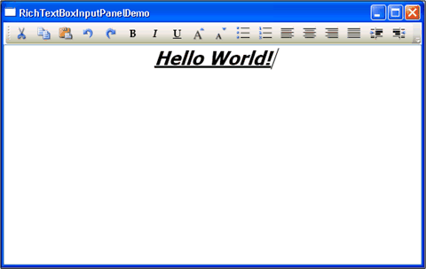

# RichTextBox Overview
The <xref:System.Windows.Controls.RichTextBox> control enables you to display or edit flow content including paragraphs, images, tables, and more. This topic introduces the <xref:System.Windows.Controls.TextBox> class and provides examples of how to use it in both [!INCLUDE[TLA#tla_xaml](../../../../includes/tlasharptla-xaml-md.md)] and [!INCLUDE[TLA#tla_lhcshrp](../../../../includes/tlasharptla-lhcshrp-md.md)].  
  
  
   
## TextBox or RichTextBox?  
 Both <xref:System.Windows.Controls.RichTextBox> and <xref:System.Windows.Controls.TextBox> allow users to edit text, however, the two controls are used in different scenarios. A <xref:System.Windows.Controls.RichTextBox> is a better choice when it is necessary for the user to edit formatted text, images, tables, or other rich content. For example, editing a document, article, or blog that requires formatting, images, etc is best accomplished using a <xref:System.Windows.Controls.RichTextBox>. A <xref:System.Windows.Controls.TextBox> requires less system resources then a <xref:System.Windows.Controls.RichTextBox> and it is ideal when only plain text needs to be edited (i.e. usage in forms). See [TextBox Overview](../../../../docs/framework/wpf/controls/textbox-overview.md) for more information on <xref:System.Windows.Controls.TextBox>. The table below summarizes the main features of <xref:System.Windows.Controls.TextBox> and <xref:System.Windows.Controls.RichTextBox>.  
  
|Control|Real-time Spellchecking|Context Menu|Formatting commands like <xref:System.Windows.Documents.EditingCommands.ToggleBold%2A> (Ctr+B)|<xref:System.Windows.Documents.FlowDocument> content like images, paragraphs, tables, etc.|  
|-------------|------------------------------|------------------|------------------------------------------------------------------------------------------------------------------------------------------------------------------------------------------------------|--------------------------------------------------------------------------------------------------------------------------------------------------------------------------------------------------|  
|<xref:System.Windows.Controls.TextBox>|Yes|Yes|No|No.|  
|<xref:System.Windows.Controls.RichTextBox>|Yes|Yes|Yes|Yes|  
  
 **Note:** Although <xref:System.Windows.Controls.TextBox> does not support formatting related commands like <xref:System.Windows.Documents.EditingCommands.ToggleBold%2A> (Ctr+B), many basic commands are supported by both controls such as <xref:System.Windows.Documents.EditingCommands.MoveToLineEnd%2A>.  
  
 The features from the table above are covered in more detail later.  
  
   
## Creating a RichTextBox  
 The code below shows how to create a <xref:System.Windows.Controls.RichTextBox> that a user can edit rich content in.  
  
 [!code-xaml[RichTextBoxMiscSnippets_snip#BasicRichTextBoxExampleWholePage](../../../../samples/snippets/csharp/VS_Snippets_Wpf/RichTextBoxMiscSnippets_snip/CSharp/BasicRichTextBoxExample.xaml#basicrichtextboxexamplewholepage)]  
  
 Specifically, the content edited in a <xref:System.Windows.Controls.RichTextBox> is flow content. Flow content can contain many types of elements including formatted text, images, lists, and tables. See [Flow Document Overview](../../../../docs/framework/wpf/advanced/flow-document-overview.md) for in depth information on flow documents. In order to contain flow content, a <xref:System.Windows.Controls.RichTextBox> hosts a <xref:System.Windows.Documents.FlowDocument> object which in turn contains the editable content. To demonstrate flow content in a <xref:System.Windows.Controls.RichTextBox>, the following code shows how to create a <xref:System.Windows.Controls.RichTextBox> with a paragraph and some bolded text.  
  
 [!code-xaml[RichTextBoxMiscSnippets_snip#RichTextBoxWithContentExampleWholePage](../../../../samples/snippets/csharp/VS_Snippets_Wpf/RichTextBoxMiscSnippets_snip/CSharp/RichTextBoxWithContentExample.xaml#richtextboxwithcontentexamplewholepage)]  
  
 [!code-csharp[RichTextBoxMiscSnippets_procedural_snip#BasicRichTextBoxWithContentCodeOnlyExample](../../../../samples/snippets/csharp/VS_Snippets_Wpf/RichTextBoxMiscSnippets_procedural_snip/CSharp/BasicRichTextBoxWithContentExample.cs#basicrichtextboxwithcontentcodeonlyexample)]
 [!code-vb[RichTextBoxMiscSnippets_procedural_snip#BasicRichTextBoxWithContentCodeOnlyExample](../../../../samples/snippets/visualbasic/VS_Snippets_Wpf/RichTextBoxMiscSnippets_procedural_snip/visualbasic/basicrichtextboxwithcontentexample.vb#basicrichtextboxwithcontentcodeonlyexample)]  
  
 The following illustration shows how this sample renders.  
  
   
  
 Elements like <xref:System.Windows.Documents.Paragraph> and <xref:System.Windows.Documents.Bold> determine how the content inside a <xref:System.Windows.Controls.RichTextBox> appears. As a user edits <xref:System.Windows.Controls.RichTextBox> content, they change this flow content. To learn more about the features of flow content and how to work with it, see [Flow Document Overview](../../../../docs/framework/wpf/advanced/flow-document-overview.md).  
  
 **Note:** Flow content inside a <xref:System.Windows.Controls.RichTextBox> does not behave exactly like flow content contained in other controls. For example, there are no columns in a <xref:System.Windows.Controls.RichTextBox> and hence no automatic resizing behavior. Also, built in features like search, viewing mode, page navigation, and zoom are not available within a <xref:System.Windows.Controls.RichTextBox>.  
  
   
## Real-time Spell Checking  
 You can enable real-time spell checking in a <xref:System.Windows.Controls.TextBox> or <xref:System.Windows.Controls.RichTextBox>. When spellchecking is turned on, a red line appears underneath any misspelled words (see picture below).  
  
   
  
 See [Enable Spell Checking in a Text Editing Control](../../../../docs/framework/wpf/controls/how-to-enable-spell-checking-in-a-text-editing-control.md) to learn how to enable spellchecking.  
  
   
## Context Menu  
 By default, both <xref:System.Windows.Controls.TextBox> and <xref:System.Windows.Controls.RichTextBox> have a context menu that appears when a user right-clicks inside the control. The context menu allows the user to cut, copy, or paste (see illustration below).  
  
   
  
 You can create your own custom context menu to override the default one. See [Position a Custom Context Menu in a RichTextBox](../../../../docs/framework/wpf/controls/how-to-position-a-custom-context-menu-in-a-richtextbox.md) for more information.  
  
   
## Editing Commands  
 Editing commands enable users to format editable content inside a <xref:System.Windows.Controls.RichTextBox>. Besides basic editing commands, <xref:System.Windows.Controls.RichTextBox> includes formatting commands that <xref:System.Windows.Controls.TextBox> does not support. For example, when editing in a <xref:System.Windows.Controls.RichTextBox>, a user could press Ctr+B to toggle bold text formatting. See <xref:System.Windows.Documents.EditingCommands> for a complete list of commands available. In addition to using keyboard shortcuts, you can hook commands up to other controls like buttons. The following example shows how to create a simple tool bar containing buttons that the user can use to change text formatting.  
  
 [!code-xaml[RichTextBox_InputPanel_snip#RichTextBoxWithToolBarExampleWholePage](../../../../samples/snippets/csharp/VS_Snippets_Wpf/RichTextBox_InputPanel_snip/CS/Window1.xaml#richtextboxwithtoolbarexamplewholepage)]  
  
 The following illustration shows how this sample displays.  
  
   
  
   
## Detect when Content Changes  
 Usually the <xref:System.Windows.Controls.Primitives.TextBoxBase.TextChanged> event should be used to detect whenever the text in a <xref:System.Windows.Controls.TextBox> or <xref:System.Windows.Controls.RichTextBox> changes rather then <xref:System.Windows.UIElement.KeyDown> as you might expect. See [Detect When Text in a TextBox Has Changed](../../../../docs/framework/wpf/controls/how-to-detect-when-text-in-a-textbox-has-changed.md) for an example.  
  
   
## Save, Load, and Print RichTextBox Content  
 The following example shows how to save content of a <xref:System.Windows.Controls.RichTextBox> to a file, load that content back into the <xref:System.Windows.Controls.RichTextBox>, and print the contents. Below is the markup for the example.  
  
 [!code-xaml[RichTextBoxMiscSnippets_snip#SaveLoadPrintRTBExampleWholePage](../../../../samples/snippets/csharp/VS_Snippets_Wpf/RichTextBoxMiscSnippets_snip/CSharp/SaveLoadPrintRTB.xaml#saveloadprintrtbexamplewholepage)]  
  
 Below is the code behind for the example.  
  
 [!code-csharp[RichTextBoxMiscSnippets_snip#SaveLoadPrintRTBCodeExampleWholePage](../../../../samples/snippets/csharp/VS_Snippets_Wpf/RichTextBoxMiscSnippets_snip/CSharp/SaveLoadPrintRTB.xaml.cs#saveloadprintrtbcodeexamplewholepage)]
 [!code-vb[RichTextBoxMiscSnippets_snip#SaveLoadPrintRTBCodeExampleWholePage](../../../../samples/snippets/visualbasic/VS_Snippets_Wpf/RichTextBoxMiscSnippets_snip/VisualBasic/SaveLoadPrintRTB.xaml.vb#saveloadprintrtbcodeexamplewholepage)]  
  
## See Also  
 [How-to Topics](../../../../docs/framework/wpf/controls/richtextbox-how-to-topics.md)   
 [TextBox Overview](../../../../docs/framework/wpf/controls/textbox-overview.md)
