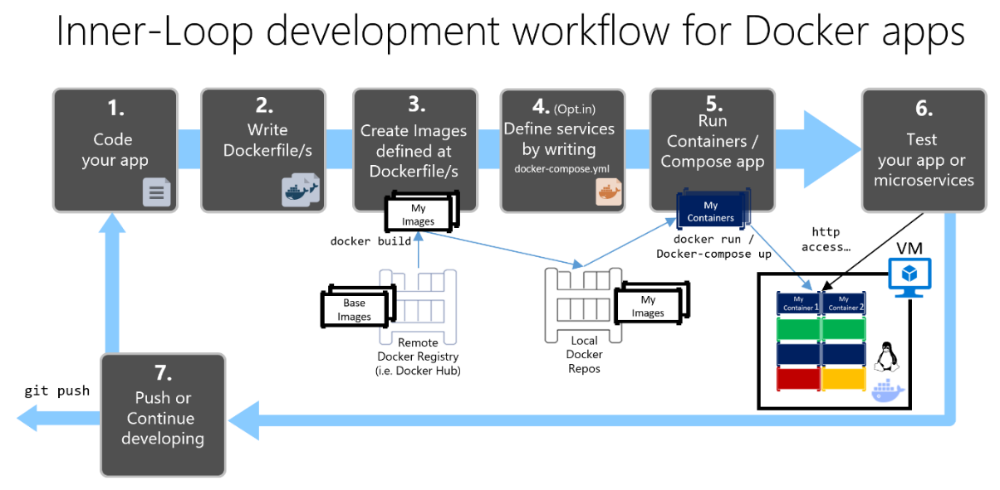
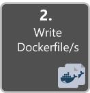
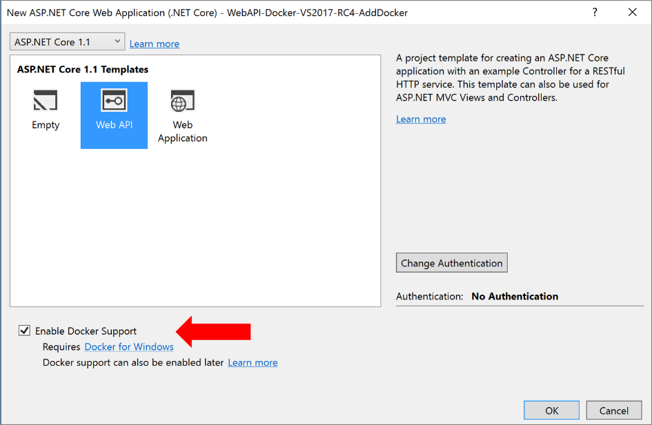
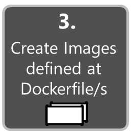
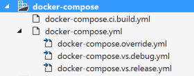
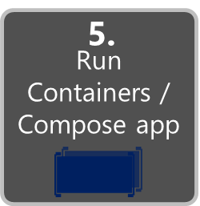
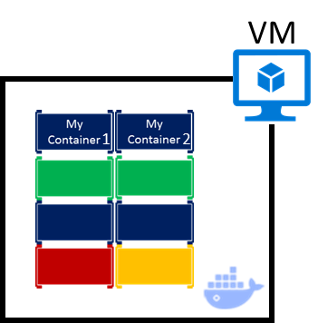

# Development workflow for Docker apps

The application development lifecycle starts at each developer’s machine, where the developer codes the application using their preferred language and tests it locally. No matter which language, framework, and platform the developer chooses, with this workflow, the developer is always developing and testing Docker containers, but doing so locally.

Each container (an instance of a Docker image) includes the following components:

-   An operating system selection (for example, a Linux distribution, Windows Nano Server, or Windows Server Core).

-   Files added by the developer (application binaries, etc.).

-   Configuration information (environment settings and dependencies).

## Workflow for developing Docker container-based applications

This section describes the *inner-loop* development workflow for Docker container-based applications. The inner-loop workflow means it is not taking into account the broader DevOps workflow and just focuses on the development work done on the developer’s computer. The initial steps to set up the environment are not included, since those are done only once.

An application is composed of your own services plus additional libraries (dependencies). The following are the basic steps you usually take when building a Docker application, as illustrated in Figure 5-1.



**Figure 5-1.** Step-by-step workflow for developing Docker containerized apps

In this guide, this whole process is detailed and every major step is explained by focusing on a Visual Studio environment.

When you are using an editor/CLI development approach (for example, Visual Studio Code plus Docker CLI on macOS or Windows), you need to know every step, generally in more detail than if you are using Visual Studio. For more details about working in a CLI environment, refer to the eBook [Containerized Docker Application lifecycle with Microsoft Platforms and Tools](http://aka.ms/dockerlifecycleebook/).

When you are using Visual Studio 2015 or Visual Studio 2017, many of those steps are handled for you, which dramatically improves your productivity. This is especially true when you are using Visual Studio 2017 and targeting multi-container applications. For instance, with just one mouse click, Visual Studio adds the Dockerfile and docker-compose.yml file to your projects with the configuration for your application. When you run the application in Visual Studio, it builds the Docker image and runs the multi-container application directly in Docker; it even allows you to debug several containers at once. These features will boost your development speed.

However, just because Visual Studio makes those steps automatic does not mean that you do not need to know what is going on underneath with Docker. Therefore, in the guidance that follows, we detail every step.


## Step 1. Start coding and create your initial application or service baseline

Developing a Docker application is similar to the way you develop an application without Docker. The difference is that while developing for Docker, you are deploying and testing your application or services running within Docker containers in your local environment (either a Linux VM or a Windows VM).

### Set up your local environment with Visual Studio

To begin, make sure you have [Docker Community Edition (CE)](https://www.docker.com/community-edition) for Windows installed, as explained in the following instructions:

[Get started with Docker CE for Windows](https://docs.docker.com/docker-for-windows/)

In addition, you will need Visual Studio 2017 installed. This is preferred over Visual Studio 2015 with the Visual Studio Tools for Docker add-in, because Visual Studio 2017 has more advanced support for Docker, like support for debugging containers. Visual Studio 2017 includes the tooling for Docker if you selected the **.NET Core and Docker** workload during installation, as shown in Figure 5-2.


**Figure 5-2**. Selecting the **.NET Core and Docker** workload during Visual Studio 2017 setup

You can start coding your application in plain .NET (usually in .NET Core if you are planning to use containers) even before enabling Docker in your application and deploying and testing in Docker. However, it is recommended that you start working on Docker as soon as possible, because that will be the real environment and any issues can be discovered as soon as possible. This is encouraged because Visual Studio makes it so easy to work with Docker that it almost feels transparent—the best example when debugging multi-container applications from Visual Studio.

### Additional resources

-   **Get started with Docker CE for Windows**
    [*https://docs.docker.com/docker-for-windows/*](https://docs.docker.com/docker-for-windows/)

-   **Visual Studio 2017**
    [*https://www.visualstudio.com/vs/visual-studio-2017/*](https://www.visualstudio.com/vs/visual-studio-2017/)



## Step 2. Create a Dockerfile related to an existing .NET base image

You need a Dockerfile for each custom image you want to build; you also need a Dockerfile for each container to be deployed, whether you deploy automatically from Visual Studio or manually using the Docker CLI (docker run and docker-compose commands). If your application contains a single custom service, you need a single Dockerfile. If your application contains multiple services (as in a microservices architecture), you need one Dockerfile for each service.

The Dockerfile is placed in the root folder of your application or service. It contains the commands that tell Docker how to set up and run your application or service in a container. You can manually create a Dockerfile in code and add it to your project along with your .NET dependencies.

With Visual Studio and its tools for Docker, this task requires only a few mouse clicks. When you create a new project in Visual Studio 2017, there is an option named **Enable Container (Docker) Support**, as shown in Figure 5-3.



**Figure 5-3**. Enabling Docker Support when creating a new project in Visual Studio 2017

You can also enable Docker support on a new or existing project by right-clicking your project file in Visual Studio and selecting the option **Add-Docker Project Support**, as shown in Figure 5-4.


**Figure 5-4**. Enabling Docker support in an existing Visual Studio 2017 project

This action on a project (like an ASP.NET Web application or Web API service) adds a Dockerfile to the project with the required configuration. It also adds a docker-compose.yml file for the whole solution. In the following sections, we describe the information that goes into each of those files. Visual Studio can do this work for you, but it is useful to understand what goes into a Dockerfile.

### Option A: Creating a project using an existing official .NET Docker image

You usually build a custom image for your container on top of a base image you can get from an official repository at the [Docker Hub](https://hub.docker.com/) registry. That is precisely what happens under the covers when you enable Docker support in Visual Studio. Your Dockerfile will use an existing aspnetcore image.

Earlier we explained which Docker images and repos you can use, depending on the framework and OS you have chosen. For instance, if you want to use ASP.NET Core and Linux, the image to use is microsoft/aspnetcore:1.1. Therefore, you just need to specify what base Docker image you will use for your container. You do that by adding FROM microsoft/aspnetcore:1.1 to your Dockerfile. This will be automatically performed by Visual Studio, but if you were to update the version, you update this value.

Using an official .NET image repository from Docker Hub with a version number ensures that the same language features are available on all machines (including development, testing, and production).

The following example shows a sample Dockerfile for an ASP.NET Core container.

```
FROM microsoft/aspnetcore:1.1
  
ARG source
  
WORKDIR /app
  
EXPOSE 80
  
COPY ${source:-obj/Docker/publish} .
  
ENTRYPOINT ["dotnet", " MySingleContainerWebApp.dll "]
```

In this case, the container is based on version 1.1 of the official ASP.NET Core Docker image for Linux; this is the setting FROM microsoft/aspnetcore:1.1. (For further details about this base image, see the [ASP.NET Core Docker Image](https://hub.docker.com/r/microsoft/aspnetcore/) page and the [.NET Core Docker Image](https://hub.docker.com/r/microsoft/dotnet/) page.) In the Dockerfile, you also need to instruct Docker to listen on the TCP port you will use at runtime (in this case, port 80, as configured with the EXPOSE setting).

You can specify additional configuration settings in the Dockerfile, depending on the language and framework you are using. For instance, the ENTRYPOINT line with \["dotnet", "MySingleContainerWebApp.dll"\] tells Docker to run a .NET Core application. If you are using the SDK and the .NET Core CLI (dotnet CLI) to build and run the .NET application, this setting would be different. The bottom line is that the ENTRYPOINT line and other settings will be different depending on the language and platform you choose for your application.

### Additional resources

-   **Building Docker Images for .NET Core Applications**
    [*https://docs.microsoft.com/dotnet/core/docker/building-net-docker-images*](https://docs.microsoft.com/dotnet/core/docker/building-net-docker-images)

-   **Build your own image**. In the official Docker documentation.
    [*https://docs.docker.com/engine/tutorials/dockerimages/*](https://docs.docker.com/engine/tutorials/dockerimages/)

### Using multi-platform image repositories

A single repo can contain platform variants, such as a Linux image and a Windows image. This feature allows vendors like Microsoft (base image creators) to create a single repo to cover multiple platforms. For example, the [microsoft/dotnet](https://hub.docker.com/r/microsoft/aspnetcore/) repository available in the Docker Hub registry provides support for Linux and Windows Nano Server by using the same repo name with different tags, as shown in the following examples:

-   microsoft/dotnet:1.1-runtime
    .NET Core 1.1 runtime-only on Linux Debian

-   microsoft/dotnet:1.1-runtime-nanoserver
    .NET Core 1.1 runtime-only on Windows Nano Server

In the future, it will be possible to use the same repo name and tag targeting multiple operating systems. That way, when you pull an image from a Windows host, it will pull the Windows variant, and pulling the same image name from a Linux host will pull the Linux variant.

### Option B: Creating your base image from scratch

You can create your own Docker base image from scratch. This scenario is not recommended for someone who is starting with Docker, but if you want to set the specific bits of your own base image, you can do so.

### Additional resources

-   **Create a base image**. Official Docker documentation.
    [*https://docs.docker.com/engine/userguide/eng-image/baseimages/*](https://docs.docker.com/engine/userguide/eng-image/baseimages/)



## Step 3. Create your custom Docker images and embed your application or service in them

For each service in your application, you need to create a related image. If your application is made up of a single service or web application, you just need a single image.

Note that the Docker images are built automatically for you in Visual Studio. The following steps are only needed for the editor/CLI workflow and explained for clarity about what happens underneath.

You, as developer, need to develop and test locally until you push a completed feature or change to your source control system (for example, to GitHub). This means that you need to create the Docker images and deploy containers to a local Docker host (Windows or Linux VM) and run, test, and debug against those local containers.

To create a custom image in your local environment by using Docker CLI and your Dockerfile, you can use the docker build command, as in Figure 5-5.


**Figure 5-5**. Creating a custom Docker image

Optionally, instead of directly running docker build from the project folder, you can first generate a deployable folder with the required .NET libraries and binaries by running dotnet publish, and then use the docker build command.

This will create a Docker image with the name cesardl/netcore-webapi-microservice-docker:first. In this case, :first is a tag representing a specific version. You can repeat this step for each custom image you need to create for your composed Docker application.

When an application is made of multiple containers (that is, it is a multi-container application), you can also use the docker-compose up --build command to build all the related images with a single command by using the metadata exposed in the related docker-compose.yml files.

You can find the existing images in your local repository by using the docker images command, as shown in Figure 5-6.


**Figure 5-6.** Viewing existing images using the docker images command

### Creating Docker images with Visual Studio

When you are using Visual Studio to create a project with Docker support, you do not explicitly create an image. Instead, the image is created for you when you press F5 and run the dockerized application or service. This step is automatic in Visual Studio, and you will not see it happen, but it is important that you know what is going on underneath.

!(./media/image10.png){width="0.8in" height="0.8in"}

## Step 4. Define your services in docker-compose.yml when building a multi-container Docker application

The [docker-compose.yml](https://docs.docker.com/compose/compose-file/) file lets you define a set of related services to be deployed as a composed application with deployment commands.

To use a docker-compose.yml file, you need to create the file in your main or root solution folder, with content similar to that in the following example:

```yml
version: '2'
  
services:
  
  webmvc:
    image: eshop/web
    environment:
      - CatalogUrl=http://catalog.api
      - OrderingUrl=http://ordering.api
    ports:
      - "80:80"
    depends_on:
      - catalog.api
      - ordering.api

  catalog.api:
    image: eshop/catalog.api
    environment: ConnectionString=Server=catalogdata;Port=5432;Database=postgres;…
    ports:
      - "81:80"
    depends_on:
      - postgres.data

  ordering.api:
    image: eshop/ordering.api
    environment:
      - ConnectionString=Server=ordering.data;Database=OrderingDb;…
    ports:
      - "82:80"
    extra_hosts:
      - "CESARDLBOOKVHD:10.0.75.1"
    depends_on:
      - sql.data

  sql.data:
    image: mssql-server-linux:latest
    environment:
      - SA_PASSWORD=Pass@word
      - ACCEPT_EULA=Y
    ports:
      - "5433:1433"

  postgres.data:
    image: postgres:latest
    environment:
      POSTGRES_PASSWORD: tempPwd
```

Note that this docker-compose.yml file is a simplified and merged version. It contains static configuration data for each container (like the name of the custom image), which always applies, plus configuration information that might depend on the deployment environment, like the connection string. In later sections, you will learn how you can split the docker-compose.yml configuration into multiple docker-compose files and override values depending on the environment and execution type (debug or release).

The docker-compose.yml file example defines five services: the webmvc service (a web application), two microservices (catalog.api and ordering.api), and two data source containers (sql.data based on SQL Server for Linux running as a container and postgres.data as a Postgres database). Each service is deployed as a container, so a Docker image is required for each.

The docker-compose.yml file specifies not only what containers are being used, but how they are individually configured. For instance, the webmvc container definition in the .yml file:

-   Uses the pre-built eshop/web:latest image. However, you could also configure the image to be built as part of the docker-compose execution with an additional configuration based on a build: section in the docker-compose file.

-   Initializes two environment variables (CatalogUrl and OrderingUrl).

-   Forwards the exposed port 80 on the container to the external port 80 on the host machine.

-   Links the web service to the catalog and ordering service with the depends\_on setting. This causes the service to wait until those services are started.

We will revisit the docker-compose.yml file in a later section when we cover how to implement microservices and multi-container apps.

### Working with docker-compose.yml in Visual Studio 2017

When you add Docker solution support to a service project in a Visual Studio solution, as shown in Figure 5-7, Visual Studio adds a Dockerfile to your project, and it adds a service section (project) in your solution with the docker-compose.yml files. It is an easy way to start composing your multiple-container solution. You can then open the docker-compose.yml files and update them with additional features.


**Figure 5-7**. Adding Docker support in Visual Studio 2017 by right-clicking an ASP.NET Core project

Adding Docker support in Visual Studio not only adds the Dockerfile to your project, but adds the configuration information to several global docker-compose.yml files that are set at the solution level.

After you add Docker support to your solution in Visual Studio, you will also see a new node (in the docker-compose.dcproj project file) in Solution Explorer that contains the added docker-compose.yml files, as shown in Figure 5-8.



**Figure 5-8**. The **docker-compose** tree node added in Visual Studio 2017 Solution Explorer

You could deploy a multi-container application with a single docker-compose.yml file by using the docker-compose up command. However, Visual Studio adds a group of them so you can override values depending on the environment (development versus production) and execution type (release versus debug). This capability will be explained in later sections.



## Step 5. Build and run your Docker application

If your application only has a single container, you can run it by deploying it to your Docker host (VM or physical server). However, if your application contains multiple services, you can deploy it as a composed application, either using a single CLI command (docker-compose up), or with Visual Studio, which will use that command under the covers. Let’s look at the different options.

### Option A: Running a single-container with Docker CLI

You can run a Docker container using the docker run command, as in Figure 5-9:

```
  docker run -t -d -p 80:5000 cesardl/netcore-webapi-microservice-docker:first
```


**Figure 5-9**. Running a Docker container using the docker run command

In this case, the command binds the internal port 5000 of the container to port 80 of the host machine. This means that the host is listening on port 80 and forwarding to port 5000 on the container.

### Option B: Running a multi-container application

In most enterprise scenarios, a Docker application will be composed of multiple services, which means you need to run a multi-container application, as shown in Figure 5-10.



**Figure 5-10**. VM with Docker containers deployed

#### Running a multi-container application with the Docker CLI

To run a multi-container application with the Docker CLI, you can run the docker-compose up command. This command uses the docker-compose.yml file that you have at the solution level to deploy a multi-container application. Figure 5-11 shows the results when running the command from your main project directory, which contains the docker-compose.yml file.


**Figure 5-11**. Example results when running the docker-compose up command

After the docker-compose up command runs, the application and its related containers are deployed into your Docker host, as illustrated in the VM representation in Figure 5-10.

#### Running and debugging a multi-container application with Visual Studio 

Running a multi-container application using Visual Studio 2017 cannot get simpler. You can not only run the multi-container application, but you are able to debug all its containers directly from Visual Studio by setting regular breakpoints.

As mentioned before, each time you add Docker solution support to a project within a solution, that project is configured in the global (solution-level) docker-compose.yml file, which lets you run or debug the whole solution at once. Visual Studio will start one container for each project that has Docker solution support enabled, and perform all the internal steps for you (dotnet publish, docker build, etc.).

The important point here is that, as shown in Figure 5-12, in Visual Studio 2017 there is an additional **Docker** command under the F5 key. This option lets you run or debug a multi-container application by running all the containers that are defined in the docker-compose.yml files at the solution level. The ability to debug multiple-container solutions means that you can set several breakpoints, each breakpoint in a different project (container), and while debugging from Visual Studio you will stop at breakpoints defined in different projects and running on different containers.


**Figure 5-12**. Running multi-container apps in Visual Studio 2017

### Additional resources

-   **Deploy an ASP.NET container to a remote Docker host**
    [*https://docs.microsoft.com/azure/vs-azure-tools-docker-hosting-web-apps-in-docker*](https://docs.microsoft.com/azure/vs-azure-tools-docker-hosting-web-apps-in-docker)

### A note about testing and deploying with orchestrators

The docker-compose up and docker run commands (or running and debugging the containers in Visual Studio) are adequate for testing containers in your development environment. But you should not use this approach if you are targeting Docker clusters and orchestrators like Docker Swarm, Mesosphere DC/OS, or Kubernetes. If you are using a cluster like [Docker Swarm mode](https://docs.docker.com/engine/swarm/) (available in Docker CE for Windows and Mac since version 1.12), you need to deploy and test with additional commands like [docker service create](https://docs.docker.com/engine/reference/commandline/service_create/) for single services. If you are deploying an application composed of several containers, you use [docker compose bundle](https://docs.docker.com/compose/reference/bundle/) and [docker deploy myBundleFile](https://docs.docker.com/engine/reference/commandline/deploy/) to deploy the composed application as a *stack*. For more information, see the blog post [Introducing Experimental Distributed Application Bundles](https://blog.docker.com/2016/06/docker-app-bundle/) in the Docker documentation. on the Docker site.

For [DC/OS](https://mesosphere.com/blog/2015/09/02/dcos-cli-command-line-tool-datacenter/) and [Kubernetes](http://kubernetes.io/docs/user-guide/deployments/) you would use different deployment commands and scripts as well.


## Step 6. Test your Docker application using your local Docker host

This step will vary depending on what your application is doing. In a simple .NET Core Web application that is deployed as a single container or service, you can access the service by opening a browser on the Docker host and navigating to that site as shown in Figure 5-13. (If the configuration in the Dockerfile maps the container to a port on the host that is anything other than 80, include the host post in the URL.)


**Figure 5-13**. Example of testing your Docker application locally using localhost

If localhost is not pointing to the Docker host IP (by default, when using Docker CE, it should), to navigate to your service, use the IP address of your machine’s network card.

Note that this URL in the browser uses port 80 for the particular container example being discussed. However, internally the requests are being redirected to port 5000, because that was how it was deployed with the docker run command, as explained in a previous step.

You can also test the application using curl from the terminal, as shown in Figure 5-14. In a Docker installation on Windows, the default Docker Host IP is always 10.0.75.1 in addition to your machine’s actual IP address.


**Figure 5-14**. Example of testing your Docker application locally using curl

### Testing and debugging containers with Visual Studio 2017

When running and debugging the containers with Visual Studio 2017, you can debug the .NET application in much the same way as you would when running without containers.

### Testing and debugging without Visual Studio

If you are developing using the editor/CLI approach, debugging containers is more difficult and you will want to debug by generating traces.

### Additional resources

-   **Debugging apps in a local Docker container**
    [*https://docs.microsoft.com/azure/vs-azure-tools-docker-edit-and-refresh*](https://docs.microsoft.com/azure/vs-azure-tools-docker-edit-and-refresh)

-   **Steve Lasker. Build, Debug, Deploy ASP.NET Core Apps with Docker.** Video.
    [*https://channel9.msdn.com/Events/Visual-Studio/Visual-Studio-2017-Launch/T115*](https://channel9.msdn.com/Events/Visual-Studio/Visual-Studio-2017-Launch/T115)

## Simplified workflow when developing containers with Visual Studio

Effectively, the workflow when using Visual Studio is a lot simpler than if you use the editor/CLI approach. Most of the steps required by Docker related to the Dockerfile and docker-compose.yml files are hidden or simplified by Visual Studio, as shown in Figure 5-15.


**Figure 5-15**. Simplified workflow when developing with Visual Studio

In addition, you need to perform step 2 (adding Docker support to your projects) just once. Therefore, the workflow is similar to your usual development tasks when using .NET for any other development. You need to know what is going on under the covers (the image build process, what base images you are using, deployment of containers, etc.) and sometimes you will also need to edit the Dockerfile or docker-compose.yml file to customize behaviors. But most of the work is greatly simplified by using Visual Studio, making you a lot more productive.

### Additional resources

-   **Steve Lasker. .NET Docker Development with Visual Studio 2017**
    [*https://channel9.msdn.com/Events/Visual-Studio/Visual-Studio-2017-Launch/T111*](https://channel9.msdn.com/Events/Visual-Studio/Visual-Studio-2017-Launch/T111)

-   **Jeffrey T. Fritz. Put a .NET Core App in a Container with the new Docker Tools for Visual Studio**
    [*https://blogs.msdn.microsoft.com/webdev/2016/11/16/new-docker-tools-for-visual-studio/*](https://blogs.msdn.microsoft.com/webdev/2016/11/16/new-docker-tools-for-visual-studio/)

## Using PowerShell commands in a Dockerfile to set up Windows Containers 

[Windows Containers](https://msdn.microsoft.com/en-us/virtualization/windowscontainers/about/about_overview) allow you to convert your existing Windows applications into Docker images and deploy them with the same tools as the rest of the Docker ecosystem. To use Windows Containers, you run PowerShell commands in the Dockerfile, as shown in the following example:

```
FROM microsoft/windowsservercore
  
LABEL Description="IIS" Vendor="Microsoft" Version="10"
  
RUN powershell -Command Add-WindowsFeature Web-Server
  
CMD [ "ping", "localhost", "-t" ]
```

In this case, we are using a Windows Server Core base image (the FROM setting) and installing IIS with a PowerShell command (the RUN setting). In a similar way, you could also use PowerShell commands to set up additional components like ASP.NET 4.x, .NET 4.6, or any other Windows software. For example, the following command in a Dockerfile sets up ASP.NET 4.5:

```
RUN powershell add-windowsfeature web-asp-net45
```

### Additional resources

-   **aspnet-docker/Dockerfile.** Example Powershell commands to run from dockerfiles to include Windows features.
    [*https://github.com/Microsoft/aspnet-docker/blob/master/4.6.2/Dockerfile*](https://github.com/Microsoft/aspnet-docker/blob/master/4.6.2/Dockerfile)

>[!div class="step-by-step"]
[Previous] (index.md)
[Next] (../net-core-single-containers-linux-windows-server-hosts/index.md)
