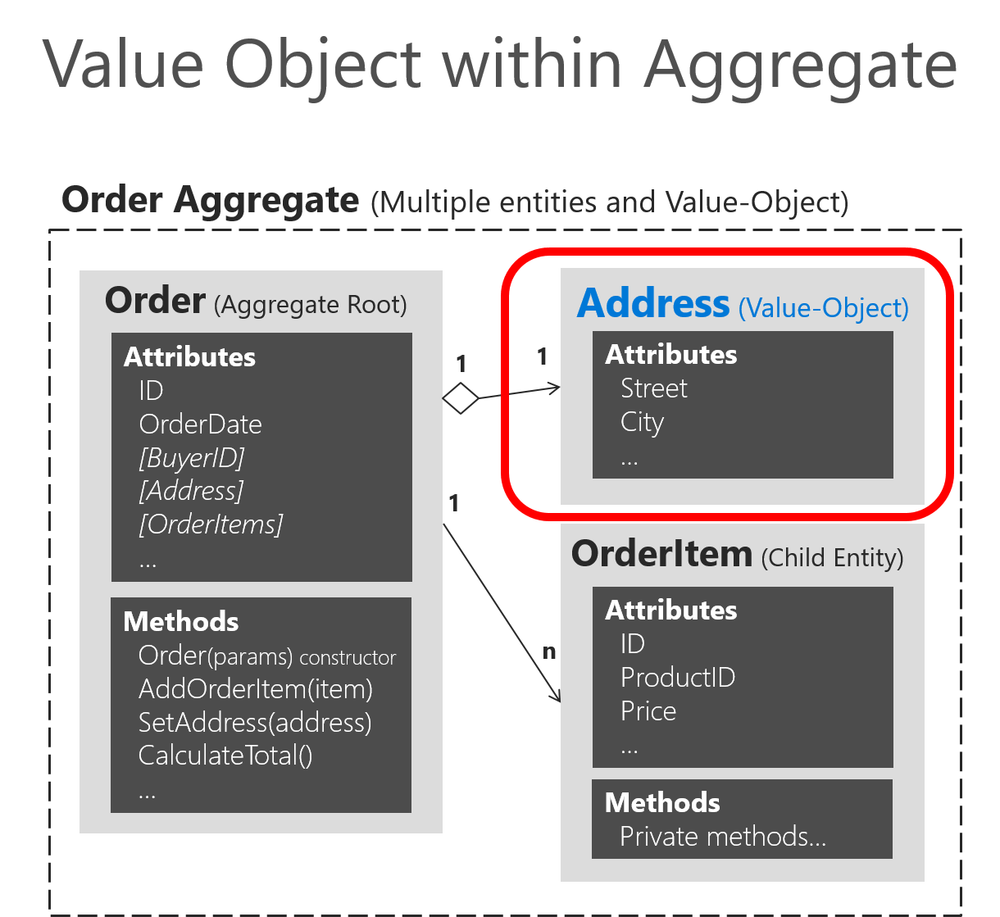

# Implementing value objects

As discussed in earlier sections about entities and aggregates, identity is fundamental for entities. However, there are many objects and data items in a system that do not require an identity and identity tracking, such as value objects.

A value object can reference other entities. For example, in an application that generates a route that describes how to get from one point to another, that route would be a value object. It would be a snapshot of points on a specific route, but this suggested route would not have an identity, even though internally it might refer to entities like City, Road, etc.

Figure 9-13 shows the Address value object within the Order aggregate.



**Figure 9-13**. Address value object within the Order aggregate

As shown in Figure 9-13, an entity is usually composed of multiple attributes. For example, Order can be modeled as an entity with an identity and composed internally of a set of attributes such as OrderId, OrderDate, OrderItems, etc. But the address, which is simply a complex value composed of country, street, city, etc. must be modeled and treated as a value object.

## Important characteristics of value objects

There are two main characteristics for value objects:

-   They have no identity.

-   They are immutable.

The first characteristic was already discussed. Immutability is an important requirement. The values of a value object must be immutable once the object is created. Therefore, when the object is constructed, you must provide the required values, but you must not allow them to change during the object’s lifetime.

Value objects allow you to perform certain tricks for performance, thanks to their immutable nature. This is especially true in systems where there may be thousands of value object instances, many of which have the same values. Their immutable nature allows them to be reused; they can be interchangeable objects, since their values are the same and they have no identity. This type of optimization can sometimes make a difference between software that runs slowly and software with good performance. Of course, all these cases depend on the application environment and deployment context.

## Value object implementation in C\#

In terms of implementation, you can have a value object base class that has basic utility methods like equality based on comparison between all the attributes (since a value object must not be based on identity) and other fundamental characteristics. The following example shows a value object base class used in the ordering microservice from eShopOnContainers.

```csharp
public abstract class ValueObject
{
    protected static bool EqualOperator(ValueObject left, ValueObject right)
    {
        if (ReferenceEquals(left, null) ^ ReferenceEquals(right, null))
        {
            return false;
        }
        return ReferenceEquals(left, null) || left.Equals(right);
    }

    protected static bool NotEqualOperator(ValueObject left, ValueObject right)
    {
        return !(EqualOperator(left, right));
    }

    protected abstract IEnumerable<object> GetAtomicValues();

    public override bool Equals(object obj)
    {
        if (obj == null || obj.GetType() != GetType())
        {
            return false;
        }

        ValueObject other = (ValueObject)obj;
        IEnumerator<object> thisValues = GetAtomicValues().GetEnumerator();
        IEnumerator<object> otherValues = other.GetAtomicValues().GetEnumerator();
        while (thisValues.MoveNext() && otherValues.MoveNext())
        {
            if (ReferenceEquals(thisValues.Current, null) ^
                ReferenceEquals(otherValues.Current, null))
            {
                return false;
            }

            if (thisValues.Current != null &&
                !thisValues.Current.Equals(otherValues.Current))
            {
                return false;
            }
        }
        return !thisValues.MoveNext() && !otherValues.MoveNext();
    }
    // Other utilility methods
}
```

You can use this class when implementing your actual value object, as with the Address value object shown in the following example:

```csharp
public class Address : ValueObject
{
    public String Street { get; private set; }
    public String City { get; private set; }
    public String State { get; private set; }
    public String Country { get; private set; }
    public String ZipCode { get; private set; }

    public Address(string street, string city, string state,
        string country, string zipcode)
    {
        Street = street;
        City = city;
        State = state;
        Country = country;
        ZipCode = zipcode;
    }

    protected override IEnumerable<object> GetAtomicValues()
    {
        yield return Street;
        yield return City;
        yield return State;
        yield return Country;
        yield return ZipCode;
    }
}
```

## Hiding the identity characteristic when using EF Core to persist value objects

A limitation when using EF Core is that in its current version (EF Core 1.1) you cannot use [complex types](https://docs.microsoft.com/de-de/dotnet/api/system.componentmodel.dataannotations.schema.complextypeattribute?view=netframework-4.7) as defined in EF 6.x. Therefore, you must store your value object as an EF entity. However, you can hide its ID so you make clear that the identity is not important in the model that the value object is part of. You hide the ID is by using the ID as a shadow property. Since that configuration for hiding the ID in the model is set up in the infrastructure level, it will be transparent for your domain model, and its infrastructure implementation could change in the future.

In eShopOnContainers, the hidden ID needed by EF Core infrastructure is implemented in the following way in the DbContext level, using Fluent API at the infrastructure project.

```csharp
// Fluent API within the OrderingContext:DbContext in the
// Ordering.Infrastructure project

void ConfigureAddress(EntityTypeBuilder<Address> addressConfiguration)
{
    addressConfiguration.ToTable("address", DEFAULT_SCHEMA);
    addressConfiguration.Property<int>("Id").IsRequired();
    addressConfiguration.HasKey("Id");
}
```

Therefore, the ID is hidden from the domain model point of view, and in the future, the value object infrastructure could also be implemented as a complex type or another way.

## Additional resources

-   **Martin Fowler. ValueObject pattern**
    [*https://martinfowler.com/bliki/ValueObject.html*](https://martinfowler.com/bliki/ValueObject.html)

-   **Eric Evans. Domain-Driven Design: Tackling Complexity in the Heart of Software.** (Book; includes a discussion of value objects)
    [*https://www.amazon.com/Domain-Driven-Design-Tackling-Complexity-Software/dp/0321125215/*](https://www.amazon.com/Domain-Driven-Design-Tackling-Complexity-Software/dp/0321125215/)

-   **Vaughn Vernon. Implementing Domain-Driven Design.** (Book; includes a discussion of value objects)
    [*https://www.amazon.com/Implementing-Domain-Driven-Design-Vaughn-Vernon/dp/0321834577/*](https://www.amazon.com/Implementing-Domain-Driven-Design-Vaughn-Vernon/dp/0321834577/)

-   **Shadow Properties**
    [*https://docs.microsoft.com/ef/core/modeling/shadow-properties*](https://docs.microsoft.com/ef/core/modeling/shadow-properties)

-   **Complex types and/or value objects**. Discussion in the EF Core GitHub repo (Issues tab)
    [*https://github.com/aspnet/EntityFramework/issues/246*](https://github.com/aspnet/EntityFramework/issues/246)

-   **ValueObject.cs.** Base value object class in eShopOnContainers.
    [*https://github.com/dotnet/eShopOnContainers/blob/master/src/Services/Ordering/Ordering.Domain/SeedWork/ValueObject.cs*](https://github.com/dotnet/eShopOnContainers/blob/master/src/Services/Ordering/Ordering.Domain/SeedWork/ValueObject.cs)

-   **Address class.** Sample value object class in eShopOnContainers.
    [*https://github.com/dotnet/eShopOnContainers/blob/master/src/Services/Ordering/Ordering.Domain/AggregatesModel/OrderAggregate/Address.cs*](https://github.com/dotnet/eShopOnContainers/blob/master/src/Services/Ordering/Ordering.Domain/AggregatesModel/OrderAggregate/Address.cs)


>[!div class="step-by-step"]
[Previous] (seedwork-domain-model-base-classes-interfaces.md)
[Next] (enumeration-classes-over-enum-types.md)
